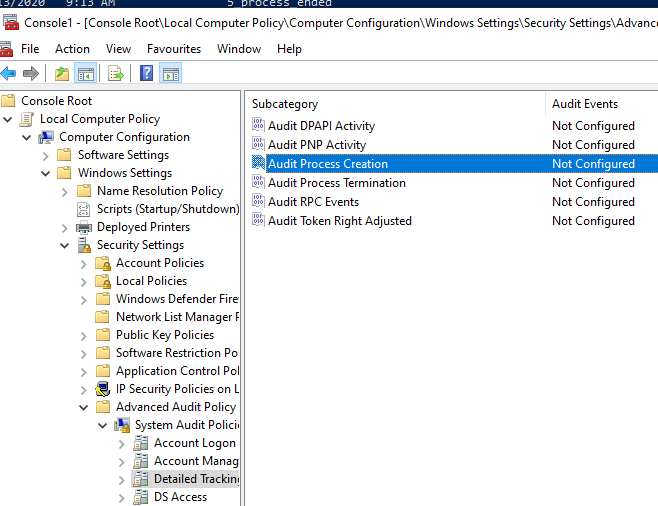
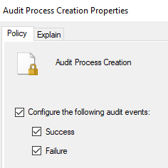
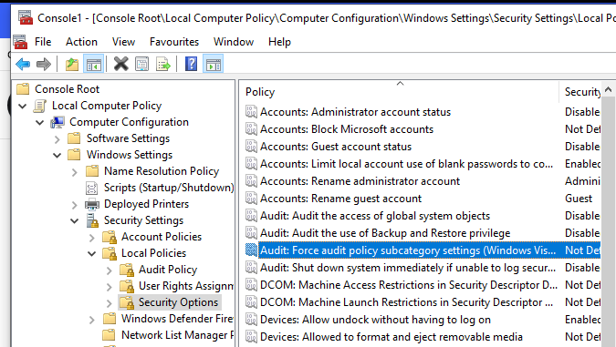
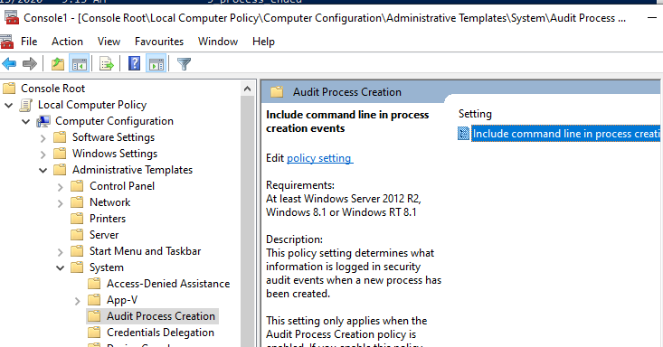
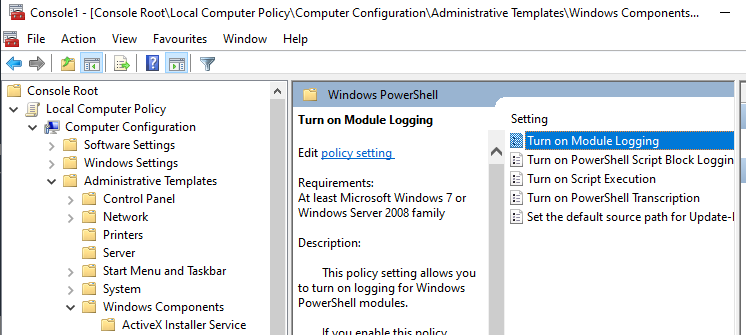
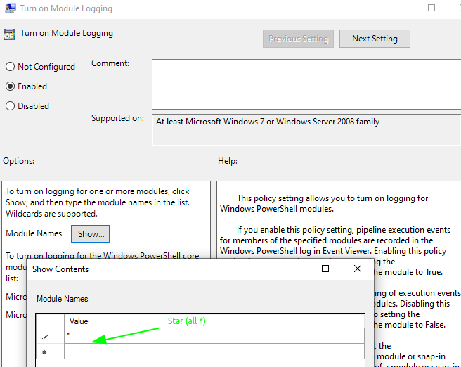
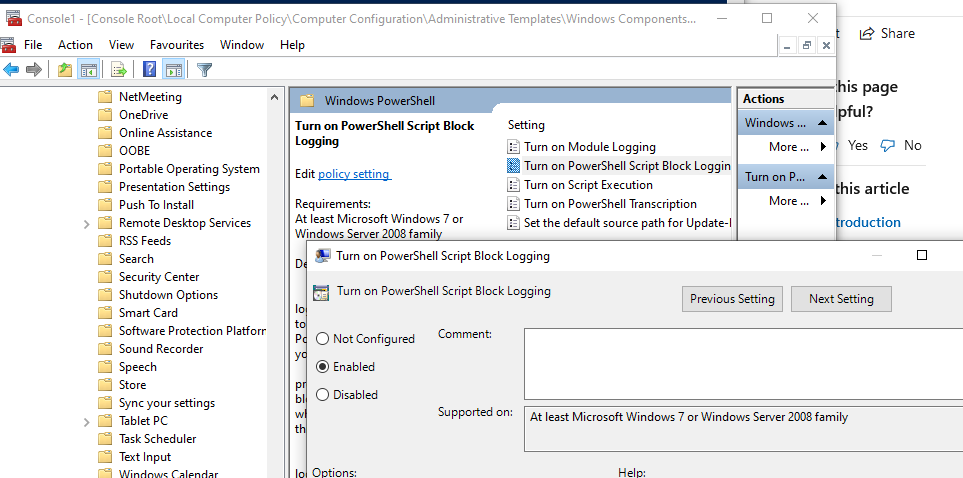
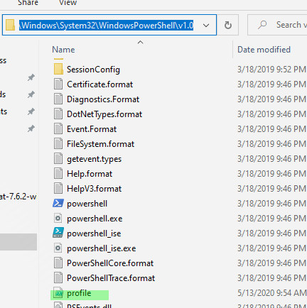
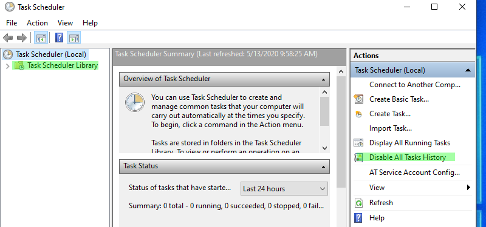

# Enable advanced Windows Logs

## Enable advanced Windows Logs

* mmc.exe
* Crtl + m
* Add Group Policy

### Enable Command line logging

* Audit Process Creation



* Enable it



* Audit Force audit policy



* Details tracking


* Admin template Audit Process Creation



### Powershell Logging

* Check for window powershell





* Also add Script Block Logging



* Create a powershell profil.ps1


```csharp
$LogCommandHealthEvent = $True
$LogCommandLifecycleEvent = $True
```

* copy it in windows powershell folder




### Enable Task Scheduled logging



