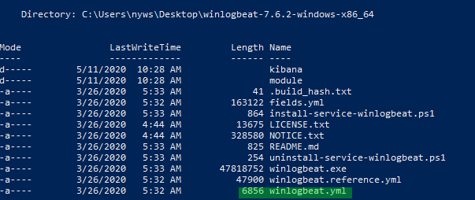
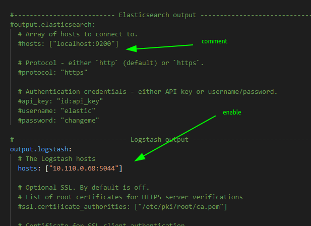
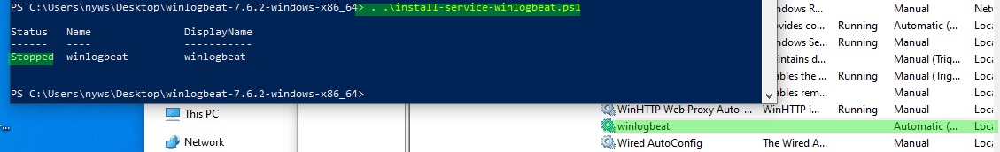

# Winlogbeat

## Winlogbeat

Used to send logs to HELK from a windows machine.



* Replace winlogbeat.yml by the one from the HELK package and set the HELK ip server



* Install the service and start it



* Autostart the service

`Set-Service -Name "winlogbeat" -StartupType Automatic`

### Add forwarded event from WEF

Add the following lines in winlogbeat

```text
winlogbeat.event_logs:
 - name: ForwardedEvents
 ignore_older: 72h
```

### Resources






