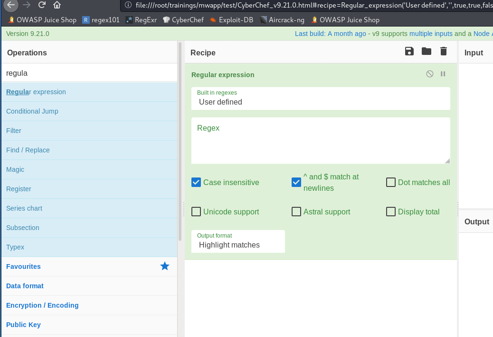

# Regex

## Regex examples

```text
. = any single chars
^ = start of the string
$ = end of string

\d = any digits
\D = any non digits
[0-9] = \d
[^0-9] = \D
\s = whitespace
\S = non whitespace
'+'' = one or more preceding
'*' = zero or more preceding
```



### Hex serial number example

```text
XXXXXXXX-XXXX-XXXX-XXXX-XXXXXXXXXXXX
```

`[0-9a-f]{8}-[0-9a-f]{4}-[0-9a-f]{4}-[0-9a-f]{4}-[0-9a-f]{12}`

### Resources








