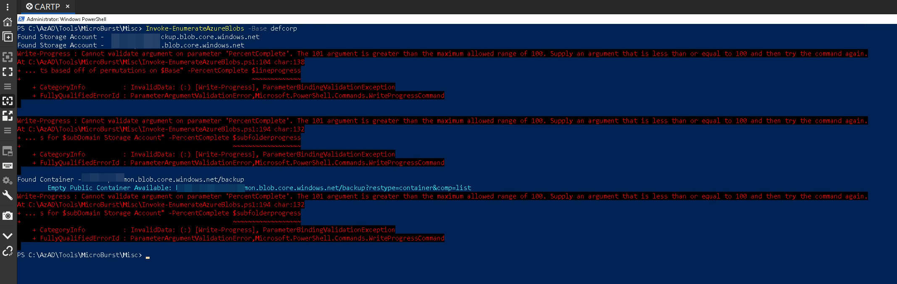

# Azure Authentication

## Overview

> Microsoft identity platform uses OpenID Connect (OIDC) for authentication and OAuth 2.0 for authorization.
>
> Azure AD supports multiple types of authentication
>
> * SAML 2.0,&#x20;
> * OIDC&#x20;
> * OAuth 2.0&#x20;
> * Header based
> * LDAP
> * Kerberos Constrained Delegation
> * ...

## Apps authentication

> An application (OAuth Client - web app, mobile apps, cli apps) can sign into an authorization server, retrieve a token and then , access to a resource (e.g. M$ Graph).

### Basic Sign-in

* User wants to access to X application, using is gmail account.

<figure><figcaption></figcaption></figure>

### Basic Sign-in with Access token acquisition

* Application needs to access to a Web API resource on behalf of a user
  * user sign-in using his credentials + consent
  * authorize endpoint on Microsoft Identity Platform returns and id\_token and an authorization\_code
  * id\_token is validated on the Web Server and a session cookie is delivered
  * Once everything is validated, the Web Server is contacting the token endpoint on microsoft identity platform to retrieve an Oauth bearer token (providing the authorization\_code, app client\_id creds ...)
  * the token endpoint returns a new token and a refresh token
  * The Web Server can then using the access\_token in the authorization header to call the Web API
  * Web API returns data to the Web Server

<figure><figcaption></figcaption></figure>

### More info

* Oauth 2.0 and OpenID Connect (OIDC) are using JWT
*   OIDC is using 3 different types of tokens:

    * **Access token:**&#x20;
      * used by the client to access resources
      * specific combination of user, client and resource
      * cannot be revoked&#x20;
      * TTL = 1 hour
    * **ID Tokens:**
      * retrieved from authorization server
      * contain basic info about the user (combination of user and client)
    * **Refresh Token:**
      * Provided to the client via access\_token
      * used to get a new access and ID token
      * default expiry is 90 days
      * can be revoked

