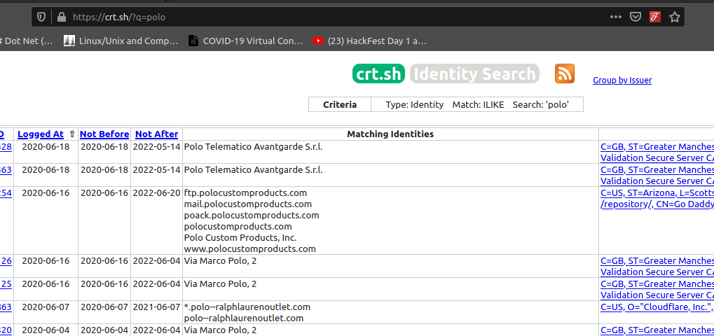
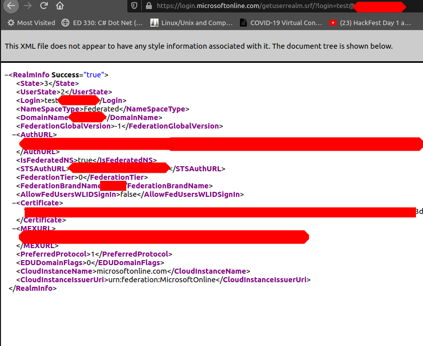

# 01-Recon

## Recon

### Search engines

* [Google](https://www.google.com)
* [Bing](https://www.bing.com) (with api)
* [Baidu](https://www.baidu.com/)
* [Duckduckgo](https://duckduckgo.com/)

### Certificat Transparency

Useful to find subdomains and top level domains.



### Shodan and Censys





### DNS bruteforcing

Lookup on potential subdomains using a good subdomains list

* [gobuster](https://github.com/OJ/gobuster)
* [amass](https://github.com/OWASP/Amass)
* [Subdomainizer](https://github.com/nsonaniya2010/SubDomainizer)

### Other services





### Arin search

Search for netblocks





Note : Azure have separated the net block range (from location to location)

### Find cloud resources from ips

* Create an ip list

`cat mylist.txt | python ip2provider.py`



### O365

check slide p39 namespace type = ADFS

### Google Gsuite

* test email ie idontexist@gmail.com

### AWS

* Bucket can host a web application (pull content from s3 bucket)
* Use burp and check for requests like&#x20;
  * https://\[bucketname].s3.amazonaws.com
  * [https://s3-\[region\].amazonaws.com/\[target](https://s3-/\[region].amazonaws.com/\[target)]

### Box.com

publicly data available from company.account.box.com

### Employees Recon

* valid employees
* public file Metadata (pdf docx)
* Determine user schema

#### Tools

#### Search for metadata from documents

* FOCA&#x20;



* Powermeta



### Linkedin

bing API -> search linkedin -> get cache info (recon-ng)

### Office 365

[https://login.microsoftonline.com/getuserrealm.srf/?login=user.name@target.com\&xml=1](https://login.microsoftonline.com/getuserrealm.srf/?login=user.name@polo.com\&xml=1)

