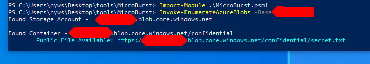

# Public Azure Blob

## Public Azure Blob

* AWS S3 like.
* Predictable URL :

  * storage-account-name.blob.core.windows.net
  * storage-account-name.file.core.windows.net
  * storage-account-name.table.core.windows.net
  * storage-account-name.queue.core.windows.net

### Tools

* Invoke-EnumerateAzureBlobs from NetSPI-MicroBurst suite
  * bruteforce storage accounts names, containers and files
  * Use permutations to discover storage accounts

```csharp
Import-Module .\MicroBurst.psm1
Invoke-EnumerateAzureBlobs  -base XXXX
```



