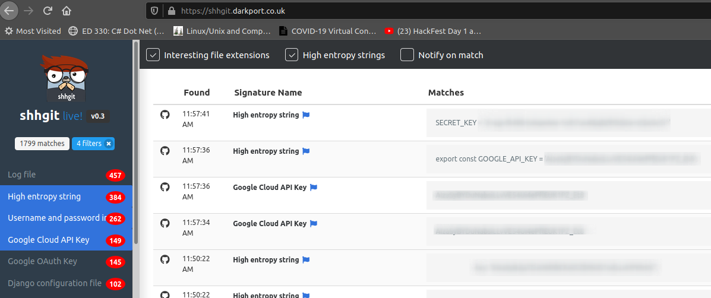
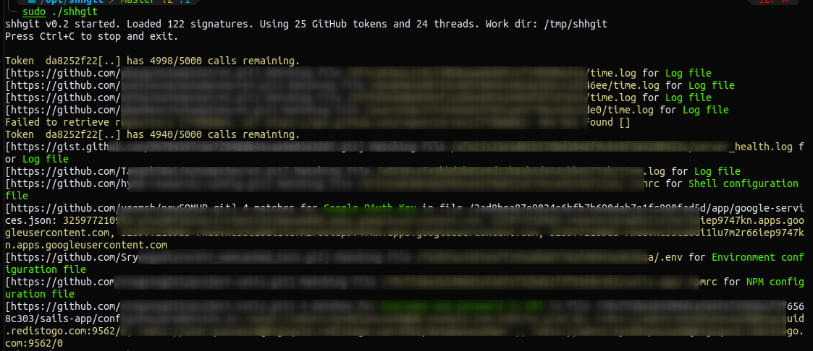
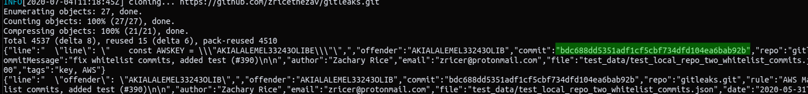
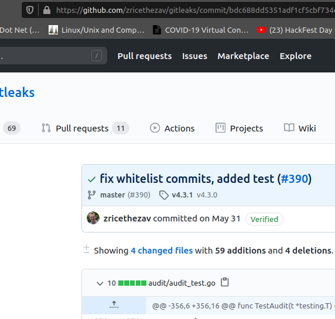

# Git Keys Disclosure

## Search for keys in public repository

* **github**
* **gitlab**
* **bitbucket**

### shhgit

* Find keys in realtime



```csharp
go get github.com/eth0izzle/shhgit
sudo git clone https://github.com/eth0izzle/shhgit
sudo GO111MODULE=on CGO_ENABLED=0 go build -v -i -o shhgit .
```

#### Create a token



* Edit config.yaml

```csharp
./shhgit --search-query AWS_ACCESS_KEY_ID=AKIA -csv-path /tmp -threads 10
```



#### Resource



### Gitleaks

Search in commits in repo. Can be used with specific user/token/organization and so on.

#### Download the latest docker version

```csharp
sudo docker pull zricethezav/gitleaks
```

#### help

```csharp
sudo docker run --rm --name=gitleaks zricethezav/gitleaks --help
```

#### Search in a specific repo

```csharp
sudo docker run --rm --name=gitleaks zricethezav/gitleaks -v -r https://github.com/zricethezav/gitleaks.git
```



* Retrieve commit change



#### Resource



