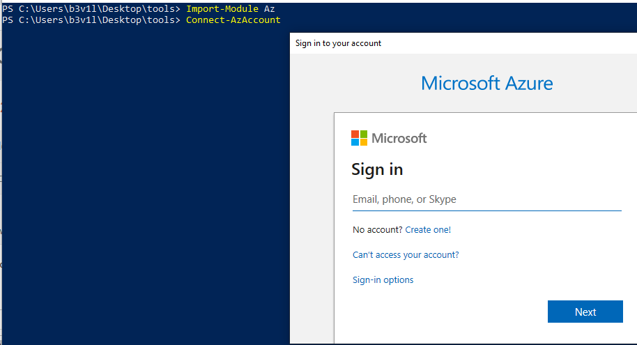
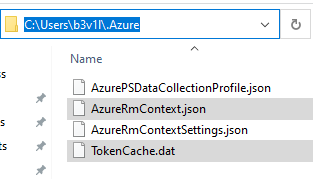
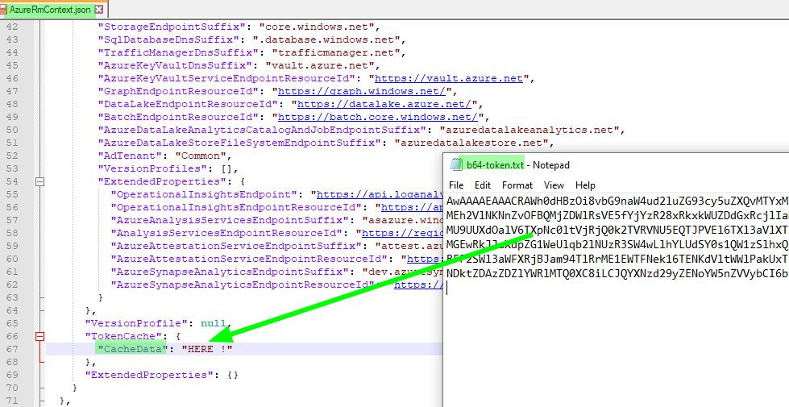
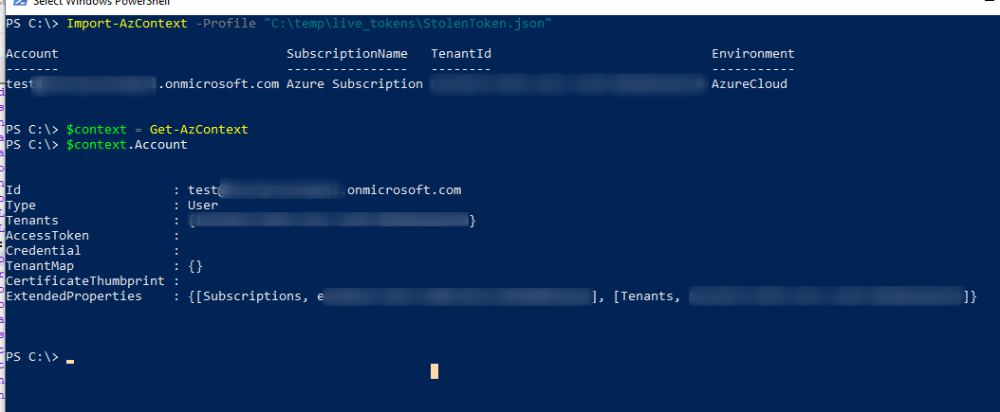

# Steal Access Tokens

## Steal Access Tokens

### Google Cloud Platform

Json tokens can be used to authenticate with gcloud and ScoutSuite

* google json tokens
* credentials.db

Can be found in `$HOME/.config/gcloud/credentials.db`

### Azure Cloud

Credentials and Certs can be found in&#x20;

* `.cspkg` packages
* Visual Studio Publish directory , ie **\<project>\bin\debug\publish**
*   Azure publish settings files, ie **.publishsettings :**

    * base64 encoded management certificat
    * cleartext creds
    * managementCertificat section in publishsettings file (export in .pfx file)
    * Download directory and VS projects


* Web config and App configs (root folder).
* Internal code Repo
  * scan web server (ports 80,443 etc) and use Eyewitness to screenshot everything to gain time
  *   Query add for hostnames and subdomains like

      * git
      * code
      * repo
      * bitbucket
      * gitlab


* Token on the disk in %USERPROFILE%\\.azure\ (TokenCache.dat) and ssaved json files
*   Command history

    * linux = .bash\_history
    * powershell = %USERPROFILE%\Appdata\Roaming\Microsoft\Windows\Powershell\PSReadline\ConsoleHost\_history.txt


### Import Stolen Azure Tokens

The victim is using powershell to connect to azure

#### Victim side

* import powershell Az module&#x20;

```csharp
Import-Module Az
Connect-AzAccount
```



#### Attacker side

* On the compromised host, create a folder and copy the victim tokens **TokenCache.dat and AzureRmContext.json**



* Import Az module and list available sessions

```bash
PS C:> import-module az 
PS C:> Get-AzContext -ListAvailable
```

* Convert stolen Token to base64:

```bash
PS C:\> import-module az
PS C:\> Get-AzContext -ListAvailable
PS C:\> $bytes = Get-Content "C:\temp\live_tokens\TokenCache.dat" -Encoding byte
PS C:\> $b64 = [Convert]::ToBase64String($bytes)
PS C:\> Add-Content "C:\temp\live_tokens\b64-token.txt" $b64
```

* Add stolen b64 text content into stolen AzureRmContext.json (CacheData line) and save it as "Whatever.json"



* import the stolen token into a new powershell session&#x20;

```bash
Import-AzContext -Profile "C:\temp\live_tokens\StolenToken.json"
$context = Get-AzContext
$context.Account
```



