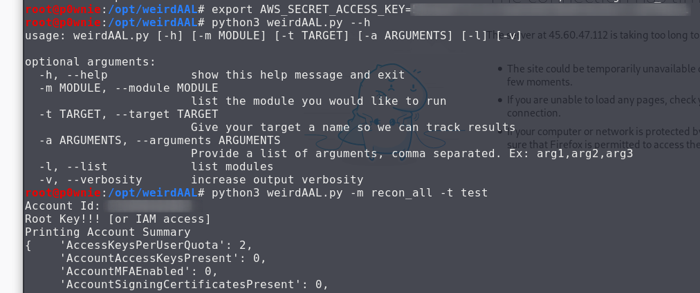
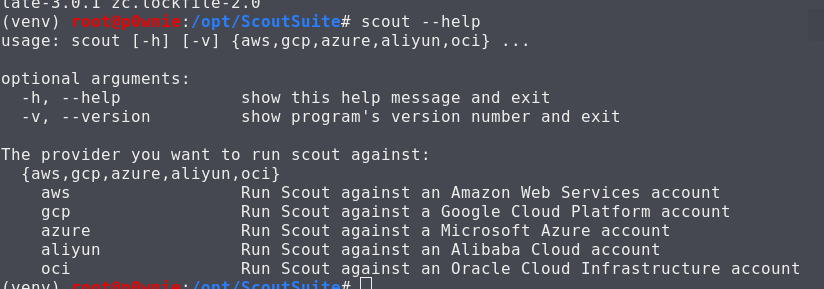
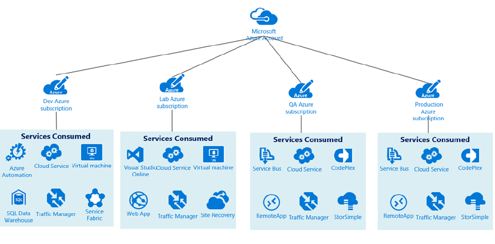
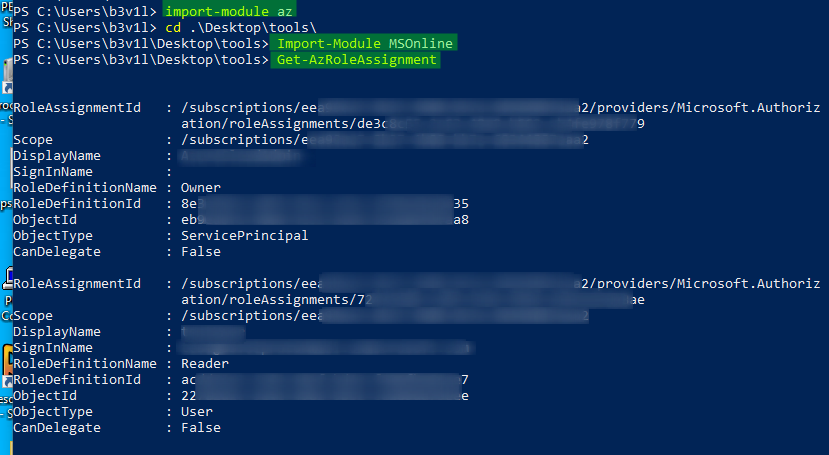

# 04-Post-compromise Recon

## Enumerating Access

### AWS

Clone the repo and export Env Variables

```csharp
git clone https://github.com/carnal0wnage/weirdAAL
export AWS_ACCESS_KEY_ID= XXXXXXXXXX
export AWS_SECRET_ACCESS_KEY= XXXXXXXXXXX

python3 weirdAAL.py -m recon_all -t test
```



#### Resource 



### Google

* Clone ScoutSuite repo

```text
git clone https://github.com/nccgroup/ScoutSuite
```

* Run it

```text
$ virtualenv -p python3 venv
$ source venv/bin/activate
$ pip install scoutsuite
$ scout --help
```



#### Resource



### Azure

Info that can be useful to retrieve :

* User info
* Subscription info
* Resource Groups
* Creds in Runbooks

Tenant = Azure Active Directory

Runbooks = Azure tasks automation

If DirSync is enable, bloodhound can be used to retrieve on premise AD info

#### Subscription Roles

| Roles | access |
| :--- | :--- |
| Owner | Full control |
| Contributor | Everything but permissions change |
| Reader | Read Attributes |
| User Access Admin | Manage user access to Azure resources |




## Azure CLI Enumeration

### Az Module

* Connect to Azure 

```text
Connect-AzAccount
```

* Get current user's role

```text
Get-AzRoleAssignment
```



Note: if the Azure portal is locked down MSonline can be used to retrieve user information

### MSOnline module

* Connecto to MSOnline service 

```csharp
Connect-MSolService
```

* Retrieve users and group 

```csharp
get-MSolUser -All
get-MSolGroup -All 
get-MSolGroupMember -GroupObjectId <GUID>
```

### Resources










