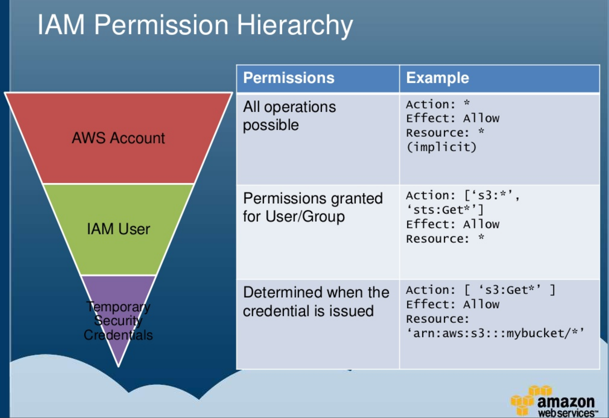
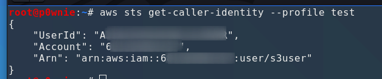
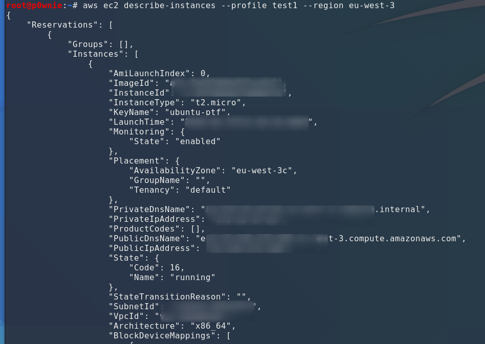
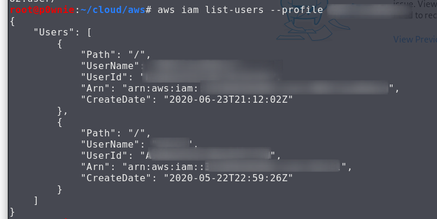
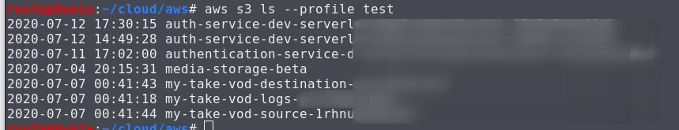

# AWS Situation Awareness

## AWS Situation awareness

* **whoami**
  * what roles
  * MFA ?
  * Resources (storage,webapps ...)
  * Who are the admins
  * Priv esc target
  * Installed Security products

### AWS Hierarchy



* AWS account = full access
* IAM user = Permissions granted on user/group
* Temp security Creds = limited access

### AWS Regions

| Region Name                | Region     Endpoint |
| -------------------------- | ------------------- |
| US East (Ohio)--           | us-east-2           |
| US East (N. Virginia)      | us-east-1           |
| US West (N. California)    | us-west-1           |
| US West (Oregon)           | us-west-2           |
| Africa (Cape Town)         | af-south-1          |
| Asia Pacific (Hong Kong)   | ap-east-1           |
| Asia Pacific (Mumbai)      | ap-south-1          |
| Asia Pacific (Osaka-Local) | ap-northeast-3      |
| Asia Pacific (Seoul)       | ap-northeast-2      |
| Asia Pacific (Singapore)   | ap-southeast-1      |
| Asia Pacific (Sydney)      | ap-southeast-2      |
| Asia Pacific (Tokyo)       | ap-northeast-1      |
| Canada (Central)           | ca-central-1        |
| China (Beijing)            | cn-north-1          |
| China (Ningxia)            | cn-northwest-1      |
| Europe (Frankfurt)         | eu-central-1        |
| Europe (Ireland)           | eu-west-1           |
| Europe (London)            | eu-west-2           |
| Europe (Milan)             | eu-south-1          |
| Europe (Paris)             | eu-west-3           |
| Europe (Stockholm)         | eu-north-1          |
| Middle East (Bahrain)      | me-south-1          |
| South America (São Paulo)  | sa-east-1           |
| AWS GovCloud (US-East)     | us-gov-east-1       |
| AWS GovCloud (US)          | us-gov-west-1       |

### AWS CLI

### Access enumeration

* get account info

```csharp
aws sts get-caller-identity --profile MYPROFILE
```



* Retrieve policy on your user (low level account)

```
aws iam list-attached-user-policies --user-name <USERNAME>
```

* Retrieve a specific policy

```
 aws iam get-policy --policy-arn arn:aws:iam::602123424321:policy/TIER1_READONLY_POLICY
```

* Retrieve policy version

```
 aws iam get-policy-version  --policy-arn arn:aws:iam::602123424321:policy/TIER1_READONLY_POLICY --version-id v1
```

* Retrieve "inline policy" associated with your user
  * first get the policy name

```
 aws iam get-group-policy
```

* then, retrieve the specific policy&#x20;

```
aws iam get-user-policy --user-name haug --policy-name S3Perms
```

* then

\`\`\`

* List EC2 instances

```csharp
aws ec2 describe-instances --profile test --region REGION
```



* List IAM user

```csharp
aws iam list-users --profile PROFILE
```



### S3 Buckets

* List all available buckets

```
 aws s3api list-buckets
```

* List S3 Buckets

```csharp
aws s3 ls --profile PROFILE
```



* List files on a specific bucket

```
aws s3 ls s3://<bucket_name>
```

### Resources




