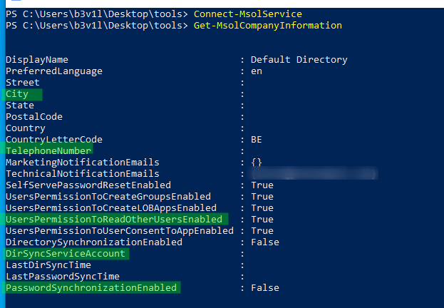
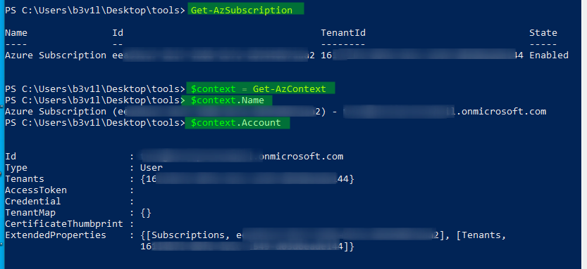
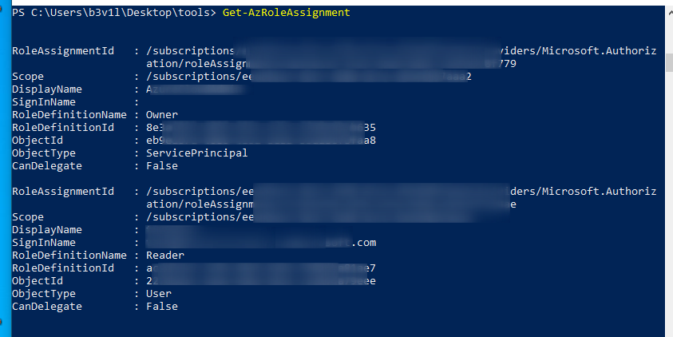
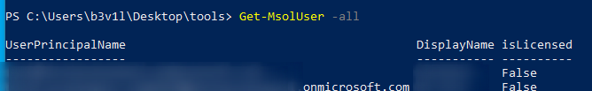

# Azure Methodology

## Azure Methodology

### **Get Basic Azure information**

```csharp
Get-MsolCompanyInformation
```



### **Retrieve subscriptions associated with the account**

```csharp
 Get-AzSubscription
 $context = Get-AzContext
 $context.Name
 $context.Account
```




### User role Enumeration \(and potential escalation target\)

```csharp
Get-AzRoleAssignment
```



### Get all users \(ie net user /domain\)

```csharp
get-msolUser -All
```



### More modules info

```csharp
Get-Module -Name Az.Accounts | Select-Object -ExpandProperty ExportedCommands
Get-Module -Name MSOnline | Select-Object -ExpandProperty ExportedCommands
```

