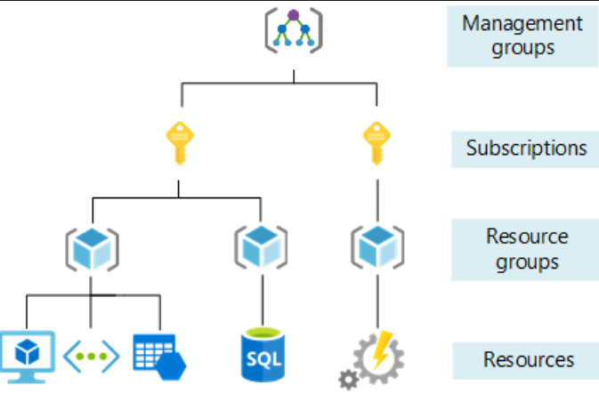
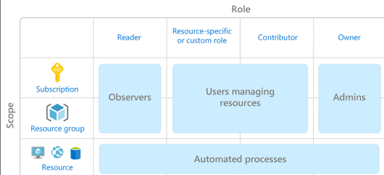
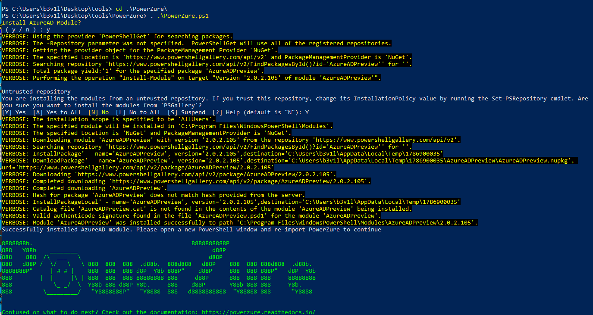
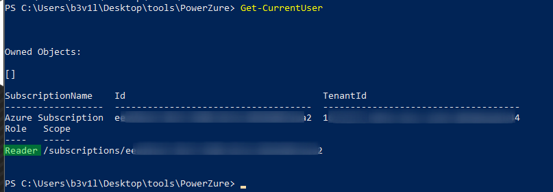
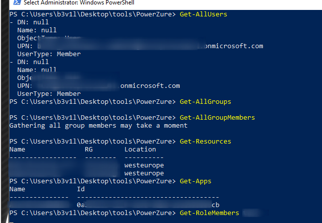
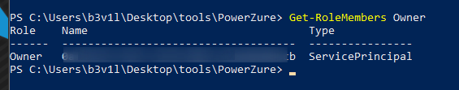

# Azure Situation Awareness

## Azure Situation Awareness

* Try to find other accounts name via azure portal
* Try CLI is portal is unreachable
* Powerzure and Microbust

Note: Directory can have multiple Tenant accesses.

* Enumerate subscription
* Roles \(owner, reader ...\)
* Gather usernames for futher attacks
* Resources
* Runbooks
* VM templates
* SQL connection
* Virtual Network

### Azure Hierarchy





### Powerzure

```csharp
git clone https://github.com/hausec/PowerZure
```



* List current user info, Enum Roles and Subscriptions

```csharp
Get-CurrentUser
```



* Enum users/groups

```csharp
get-allusers
get-allgroups
get-groupmembers
```



* Get Resources list

```csharp
get-resources
```

* List applications 

```csharp
get-apps
```

* List members of a role

```csharp
get-rolemembers ROLE
```



* List webapps

```csharp
get-webapps
```

* List key vaults

```csharp
get-keyvaults
```

* List storage accounts

```csharp
Get-StorageAccounts
```

* List Runbooks

```csharp
get-runbooks
```

* List Virtual Machine

```csharp
get-vms
```

### Active Directory

* powerview
* Bloodhound
* HostRecon

### Resources







