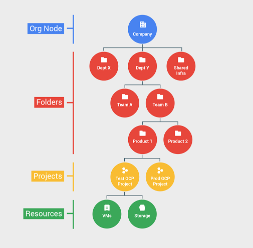

# GCP Situation Awareness

## GCP Situation Awareness

### GCP Hierarchy

* Organization = root node
* Folders = grouping/isolating Projects
* Projects = Group resources

Note: IAM roles can be applied at each level and are not herited from parents



#### Tools

* gcloud : managing auth,config and interact with services
* gsutil : access GCP storage buckets

### Gcloud

* get account info 

```csharp
gcloud config list
```

* List Organization 

```text
gcloud organization list
```

* Enumarate IAM policies

```csharp
gcloud organization get-iam-policy ORGANIZATION_ID
```

* Set project

```csharp
gcloud config set project PROJECT_NAME
```

* Metadata \(aka 169.254.169.254\)

```csharp
curl http://metadata.google.internal/computeMetada/v1/instance/service-accounts/default/scopes -H 'Metadata-Flavor:Google'
```

* List Google compute instance \(in the same project\)

```text
gcloud compute instances list
```

### GSutil

* List Google storage buckets

```text
gsutil ls
```

* List Google Storage recursively

```csharp
gsutil ls -r gs://bucketname
```

