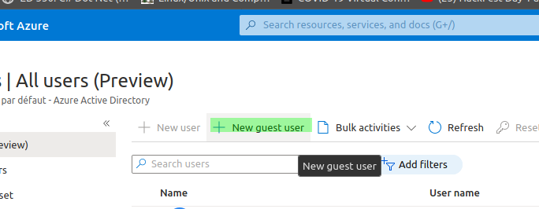
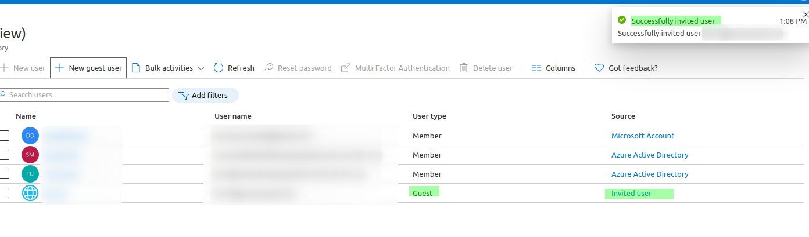

# Azure Guest User

## Azure Guest User

### Azure Guest User accounts

* By default user can add "guest users" from outside the directory \(At least Read permission\).
* This guest users can be sync with on-prem AD in case of hybrid ENV

* **From AD users list**

