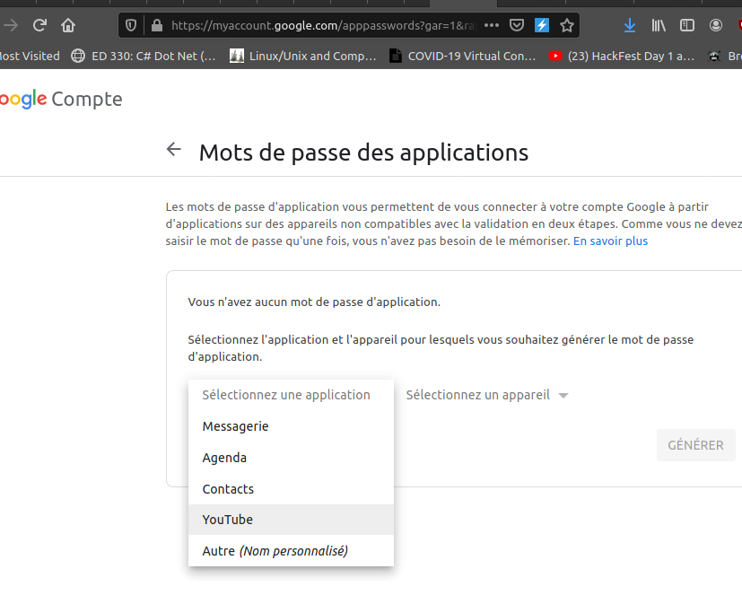

# G-Suite

## G-Suite Persistence Techniques

* App passwords :
  * Way to bypass MFA
  * Unfortunately revoked if user change his password



* Backup Codes
  * Requires the user password 
* API and service account tokens
  * create a new project on cloud.google.com
    * Enable API's scope to ANY 
  * Create a private JSON key file for service account

```csharp
glcoud iam service accounts keys create --iam-account my-iam-testingaccount@domain.com key.json
```

