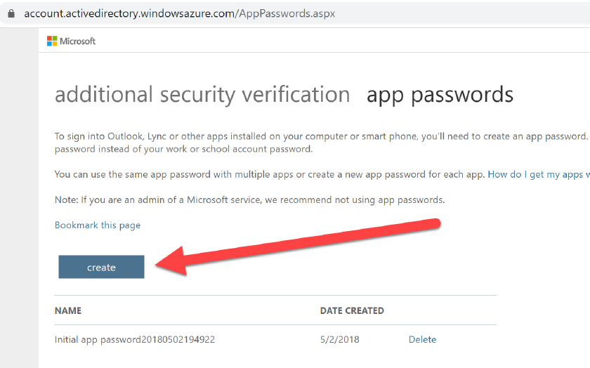

# O365

## O365 Persistence

In case we have compromised an account using MFA, from the office portal ce can create an App Password which can be used as an backdoor account \(with MFA disabled\)

* From portal.office.com, Sec & privacy, additional sec verification, create and manage app passwords

* Click on create, provide an application name and save the value. This can be used to access to the account bypassing MFA

