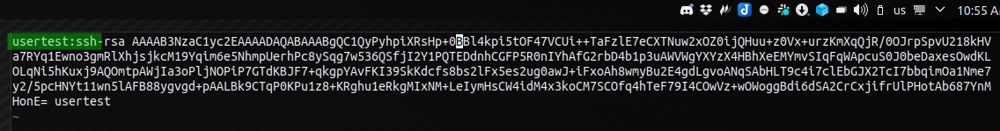

# GCP Privilege Escalation

## GCP Privilege Escalation

#### 2 user types:

* User = user/password
* Service Accounts :
  * no password
  * Every GCP project has a 'Default' service account
  * Every process running on the instance can authenticate as the service account

### Bucket Access

From a compromised "compute instance" \(ie shell\), the default service account can access to every storage bucket

#### Check for service account

`gcloud config list`

Search for similar output :

### Metadata Server

Like AWS and Azure there is a Metadata endpoint \(169.254.169.254\). Google-account-daemon connects to the Metadata server to setup local Linux accounts.

**-&gt; Any public ssh key inserted into the metadata server get a root account :**

A new public key equal a new root account on the instance.

To be able to add a public key we need :

* default permission set to "Full Access to Cloud APIs"
* Custom IAM perms:

  * compute.instances.setMetadata
  * compute.projects.setCommonInstanceMetada

#### public key

* Create a ssh keys :

`ssh-keygen -t rsa`

* Update the instance Metadata

`gcloud compute instances add-metadata <INSTANCE_NAME> -- metadata-from-file ssh-keys=mykey.txt`

* Connect using the user / key pair

### GCP Web Console

Only available to user accounts \(not service accounts\)

* Add a new editor to an existing project :

`gcloud projects add-iam-policy-binding <PROJECT_NAME> --member user:<email address> --role roles/editor`

