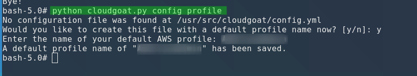
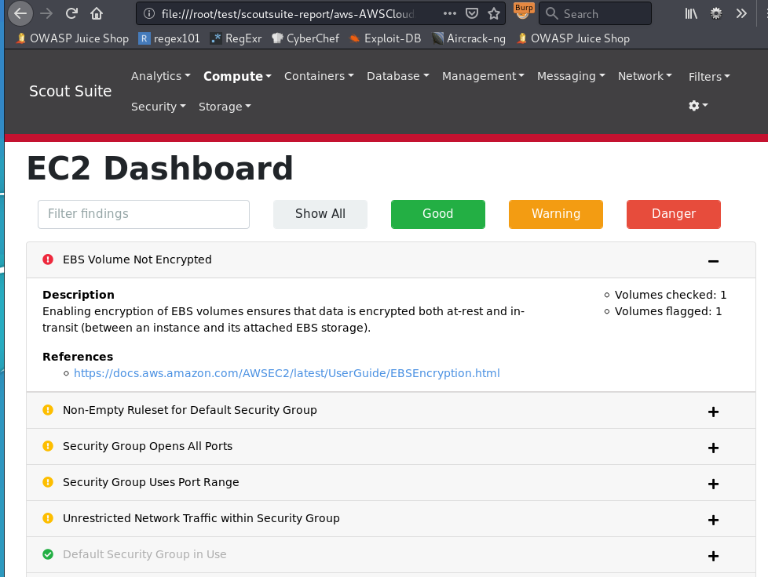

# Vulnerabilities Scanners

## ScoutSuite

Very noisy but can help for vulnerability checks

#### Support :

* Amazon Web Service
* Microsoft Azure
* Google Cloud Platform
* Alibaba Cloud
* Oracle Cloud 

### CloudGoat POC 

#### Start CloudGoat Docker :

```csharp
root@p0wnie:~/trainings# docker run -it -v ~/.aws:/root/.aws rhinosecuritylabs/cloudgoat:latest
bash-5.0# python cloudgoat.py config profile

```

#### Use your AWS account admin name :



#### Create a SSRF scenario :

```csharp
bash-5.0# python cloudgoat.py create ec2_ssrf
```

#### Install ScoutCloud on the attack machine:

```csharp
virtualenv -p python3 venv
source venv/bin/activateource venv/bin/activate
pip install scoutsuite
```


#### Launch the scan

```csharp
 root@p0wnie:~/test/venv/bin# scout aws --profile=AWSCloudAdmin
```

#### Get the report 



#### Destroy the lab :

```csharp
python cloudgoat.py deployed
python cloudgoat.py destroy ec2_ssrf_cgidpgfpfmbv7v

```

### Resources



## CloudSploit

#### Support :

* Amazon Web Service
* Microsoft Azure
* Google Cloud Platform
* Oracle Cloud 

### Resources



## WeirdAAL \(AWS Attack Library\)

Enumeration and vuln discovery tool. Works great with AWS

### Resources




