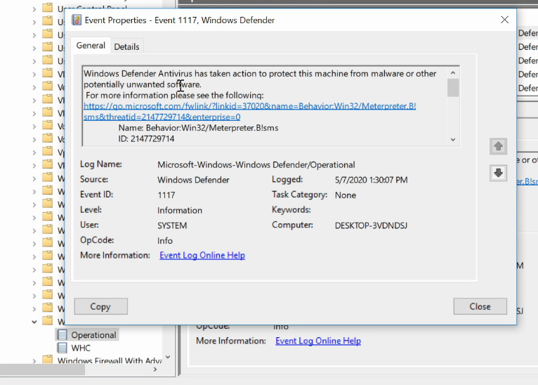

# AMSI bypass via unicorn

## AMSI - unicorn

hook process memory space

-&gt; AMSI scan \(2 API SmsiScanString\)

create a payload , decode

break the code on windows using powershell ise

* add variables:

test or int int

### scanning memory space :

it search

psamsi true or flase

POC exploitdb





Rasta mouse :

disable amsi in the process space



Win32 to 1111

-&gt; detected

tweak

### Resources



