# Putty backdoor \(32bits\)

## Putty backdoor \(32bits\)

32bits application = 32bits debugger ...

### Search for code cave

* Open the file \(open not attach\) in the 32bits debugger
* Since we are in text section, we can usually find space at the end

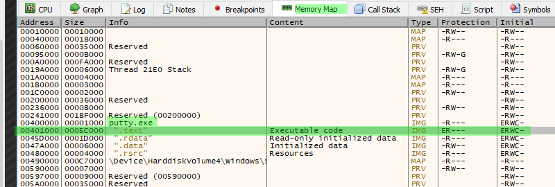

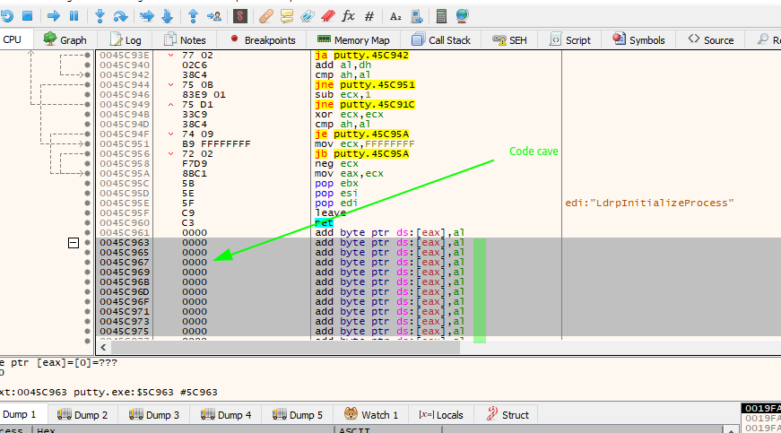

* Set a breakpoint into the code cave start \(XXXXXX961\)

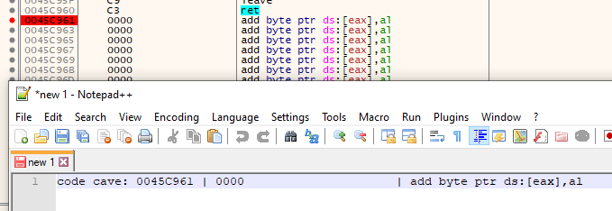

### Create/add a jmp instruction

* From putty first entry point, we need to create a jmp to reach the code cave \(backup putty instruction first\):

  ```text
  00454AD0 | 6A 60                            | push 60                              
  00454AD2 | 68 B07A4700              | push putty.477AB0                    
  00454AD7 | E8 08210000              | call putty.456BE4                    
  00454ADC | BF 94000000              | mov edi,94             
  00454AE1 | 8BC7                             | mov eax,edi
  ```

* Use Assemble and create the jmp suting the code cave address

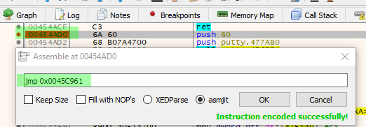

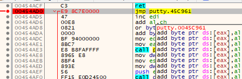

### Add pushad and pushfd

* To avoid change in the program, we need to save all the registers values and flags values.

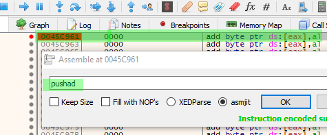

### Add shellcode

* Select empty space:

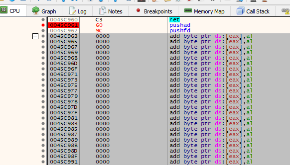

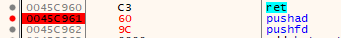

* Create a 32 bits shellcode in C format, select the empty space and select Binaries -&gt; edit. Then, paste the shellcode.

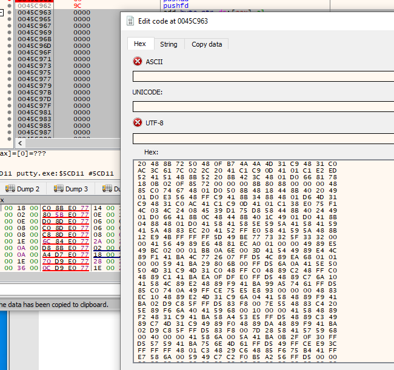

### Patch file

* Right click, patch, select all. Create a new exe patched file:

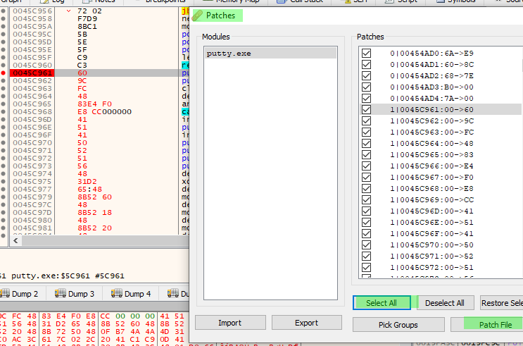

* Get a shell \(putty doesn't run BTW ...\)

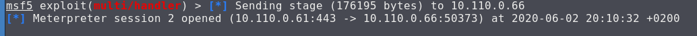

### Search the exit code

* Set a breakpoint on ANY shellcode call instruction :

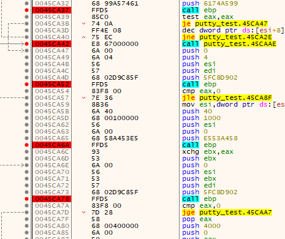

* Find the last Call before the program exits.
* From there, select the previous push 0 instructionand replace it by a jmp into a new empty space
* From there, restore flads and registry values using popfd and popad instructions
* Next, retrieve putty register instructions, select few lines into the free memory and copy the hex values:

00454AD0 \| 6A 60 \| push 60  
00454AD2 \| 68 B07A4700 \| push putty.477AB0  
00454AD7 \| E8 08210000 \| call putty.456BE4

**6A 60 68 B0 7A 47 00**

* Last step is to create a jmp into the putty call instruction \(ie 00454AD7\)

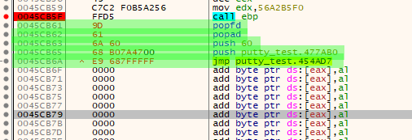

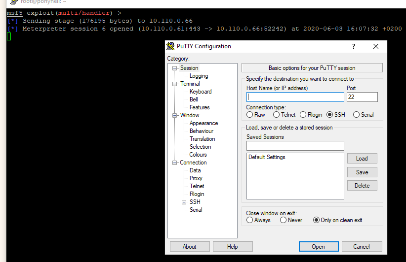

