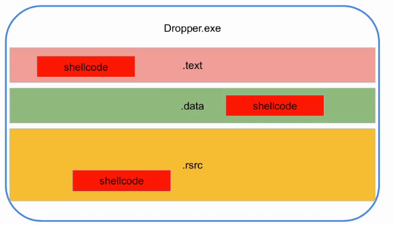

# Droppers

## Droppers and payloads

Droppers = special programs which delivers payload on the victim and execute it.

### Where to store the payload in the dropper

* .text
* .data
* .rsrc



1. **.text** : place the payload into a function \(main for instance\)
2. **.data**: tell the compiler that the payload is Read Only Data \(into a global variable for instance\)
3. **.resource** is a dedicated section used to store other files \(ie icons, image, manifest\). We can create a file containing a payload.

### Buffer manipulation and used function

To avoid detection the best thing to do is to

1. Create a buffer and set it Read and write access using `VirtualAlloc` function:

```cpp
readwrite_mem = VirtualAlloc(0, calc_len, MEM_COMMIT | MEM_RESERVE, PAGE_READWRITE);
```

1. 2 Turn it executable using `VirtualProtect` function:

```cpp
exec_buf = VirtualProtect(readwrite_mem, calc_len, PAGE_EXECUTE_READ, &oldprotect);
```

