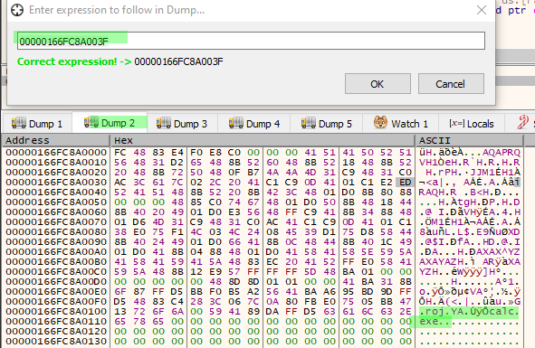

# Resources Section

## Resources Section

### Code overview

* No payload in the code but integrated on the .h file
* Payload is initialized by 3 functions :
  * res = **FindResource**\(NULL, MAKEINTRESOURCE\(FAVICON\_ICO\), RT\_RCDATA\);
  * resHandle = **LoadResource**\(NULL, res\);
  * payload = \(char  _\) **LockResource**\(resHandle\);\*_
* **FindResource**

```cpp
res = FindResource(NULL, MAKEINTRESOURCE(FAVICON_ICO), RT_RCDATA);
```

FindResource = locate the resource in PE file \(FAVICON\_ICON\)

1. **LoadResource**

Load some kind of module containing our resource

```cpp
resHandle = LoadResource(NULL, res);
```

1. **Lockresource**

Return an address \(pointer\) of our payload

```cpp
payload = (char *) LockResource(resHandle);
```

payload size is defined by **SizeofResource\(\)**

```cpp
payload_len = SizeofResource(NULL, res);
```

### Resources.rc

* The file provide info about calc.ico which has been generated by msfvenom

FAVICON\_ICO is a type RCDATA and the data is located in the file calc.ico

```cpp
#include "resources.h"

FAVICON_ICO RCDATA calc.ico
```

### resources.h

Define FAVICON\_ICO plus a number

```cpp
#define FAVICON_ICO 100
```

### Resource compilation

Using rc compilator and resources.rc

`rc resources.rc`

### Convert res file into an object

`cvtres /MACHINE:x64 /OUT:resources.o resources.res`

### C compiler to compile the whole program

`cl.exe /nologo /Ox /MT /W0 /GS- /DNDEBUG /Tctestrsrc.cpp /link /OUT:testrsrc.exe /SUBSYSTEM:CONSOLE /MACHINE:x64 resources.o`

### Debugger


* On the dump windows 1, use ctrl-G \(goto expression\) and search for the payload address :


* On the dump window 2, goto expression for exec\_mem addr and verify that the payload is there \(and will be executed\)



#### Set the break point before payload execution

In CPU window, goto expression using the same address and set a break point before the payload execution:


Continue \(run\) the program, reach the breakpoint, set a new break point same place and run. Calc pop up.

