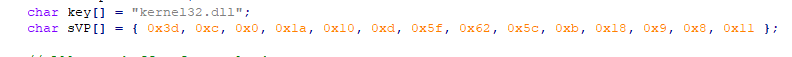

# Function Call Obfuscation

## Function Call Obfuscation

* EXE and DLL use external dll which are mapped into a process memory to make the the function available to by the code.
* AV industry analyze binaries's import address table and compare functions with are well known function used in malwares.

### Standar Windows API

The goal is to hide dll and external function. This can be done with the Windows API using :

1. **GetModuleHandle** : return the handle of the specific DLL.
2. **GetProcAddress** : return the memory address of the function needed \(exported from the DLL\)

### Search for imported function from an EXE

Using dumpbin, we can verify function and where they are coming from.

* Example: VirtualProtect is provided by kernel32.dll

`dumpbin /imports test.exe`

```bash
Microsoft (R) COFF/PE Dumper Version 14.26.28805.0
Copyright (C) Microsoft Corporation.  All rights reserved.


Dump of file test.exe

File Type: EXECUTABLE IMAGE

  Section contains the following imports:

    KERNEL32.dll
             140013000 Import Address Table
             14001C3F0 Import Name Table
                     0 time date stamp
                     0 Index of first forwarder reference

                         5E6 WaitForSingleObject
                          F2 CreateThread
                         5D5 VirtualAlloc
                         5DB VirtualProtect
                         450 QueryPerformanceCounter
                         21E GetCurrentProcessId
                         222 GetCurrentThreadId
                         2F0 GetSystemTimeAsFileTime
                         36C InitializeSListHead
                         4D3 RtlCaptureContext
                         4DA RtlLookupFunctionEntry
                         4E1 RtlVirtualUnwind
                         382 IsDebuggerPresent
                         5BC UnhandledExceptionFilter
                         57B SetUnhandledExceptionFilter
                         2D7 GetStartupInfoW
                         389 IsProcessorFeaturePresent
                         27E GetModuleHandleW
                         620 WriteConsoleW
                         4E0 RtlUnwindEx
                         267 GetLastError
                         53F SetLastError
                         135 EnterCriticalSection
                         3C0 LeaveCriticalSection
                         111 DeleteCriticalSection
                         368 InitializeCriticalSectionAndSpinCount
                         5AC TlsAlloc
                         5AE TlsGetValue
```

### VirtualProtect obfuscation

Declare VirtualProtect has a global variable.



```cpp
BOOL VirtualProtect(
  LPVOID lpAddress,
  SIZE_T dwSize,
  DWORD  flNewProtect,
  PDWORD lpflOldProtect
);
```

`BOOL VirtualProtect(LPVOID lpAddress, SIZE_T dwSize, DWORD flNewProtect, PDWORD lpflOldProtect);`

* But turns the variable into a pointer using WINAPI :

`BOOL (WINAPI * pVirtualProtect)(LPVOID lpAddress, SIZE_T dwSize, DWORD flNewProtect, PDWORD lpflOldProtect);`

* Initialize the function in main 

`pVirtualProtect = GetProcAddress(GetModuleHandle("kernel32.dll"), "VirtualProtect");`

Before the change :

```bash
C:\Users\b3v1l\Desktop\>dumpbin /imports test.exe | findstr /i "virtual"
                         5D5 VirtualAlloc
                         5DB VirtualProtect
                         4E1 RtlVirtualUnwind
```

* After:

```bash
C:\Users\b3v1l\Desktop\dumpbin /imports test.exe | findstr /i "virtual"
                       5D5 VirtualAlloc
                       4E1 RtlVirtualUnwind
```

### Search for the VirtualProtect as a string in the exe \(using sysinternal strings command\)

VirtualProtect cannot be found in memory, but can still be found as a string in the EXE

`strings.exe -n 8 implant.exe | findstr /i "virtua"`

```bash
virtual displacement map'
VirtualAlloc
RtlVirtualUnwind
VirtualProtect
```

### XOR encryption is encrypt strings

We can encrypt strings using XOR \(and provide a key\). The strings we want to hide will be encrypted...

In the code, create a XOR function, set up a key an declare a string

```cpp
char key[] = "supersecret";
char sVP[] = "";
```

#### Remove VirtualProtect

`pVirtualProtect = GetProcAddress(GetModuleHandle("kernel32.dll"), sVP);`

#### add a XOR function

`XOR((char *) sVP, strlen(sVP), key, sizeof(key));`

#### Key obfuscation \(add something from strings output\)

kernel32.dll, something not to obvious....

```cpp
VirtualProtect
**kernel32.dll**

abcdefghijklmnopqrstuvwxyz
ABCDEFGHIJKLMNOPQRSTUVWXYZ

abcdefghijklmnopqrstuvwxyz
ABCDEFGHIJKLMNOPQRSTUVWXYZ
```

And XOR the malicious payload :

```cpp
char key[] = "kernel32.dll";
char sVP[] = "";
```

#### Using python in iteractive mode, use XOR function for sVP using the key \(printC for formating the output\)

`printC(xor("VirtualProtect","kernel32.dll"))`

```cpp
{ 0x3d, 0xc, 0x0, 0x1a, 0x10, 0xd, 0x5f, 0x62, 0x5c, 0xb, 0x18, 0x9, 0x8, 0x11 };
```

* Edit the code



* Compile and test
* Use strings again and confirm the function name doesn't appear anymore

`strings.exe -n 8 implant.exe | findstr /i "virtua"`

```cpp
virtual displacement map'
VirtualAlloc
RtlVirtualUnwind
```

