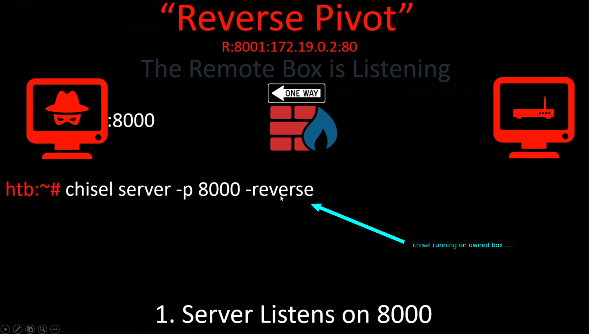
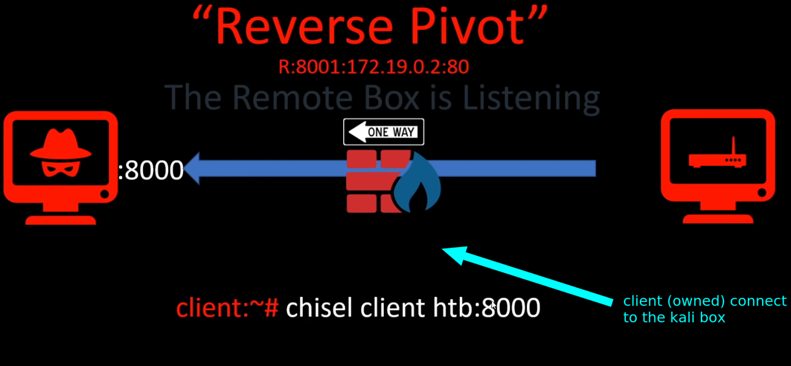
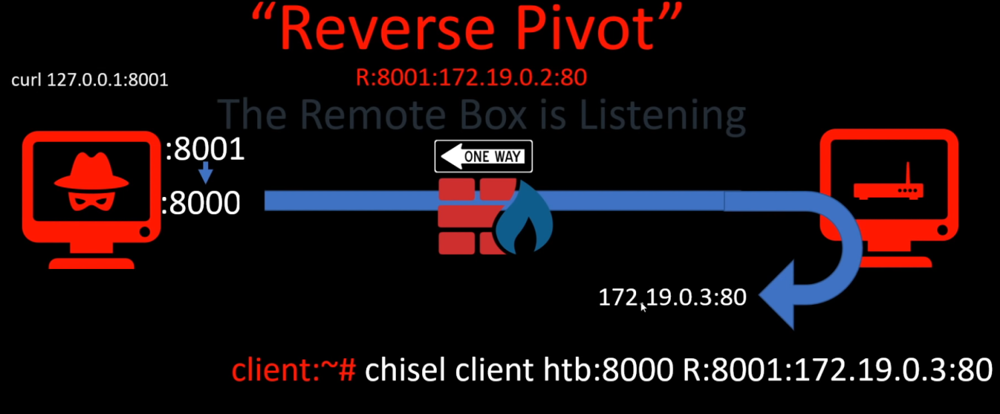

# reverse pivot

## reverse pivot

* Remote box \(which is listening\) is the attacking machine \(kali\)...

1. So the client create a tunnel with the remote box on port 8000
2. The client create a reverse port 8001 on the server and forward the packet in the port 80 on the client
3. server can do curl [http://127.0.0.1:8001](http://127.0.0.1:8001/) to reach the client port 80.



