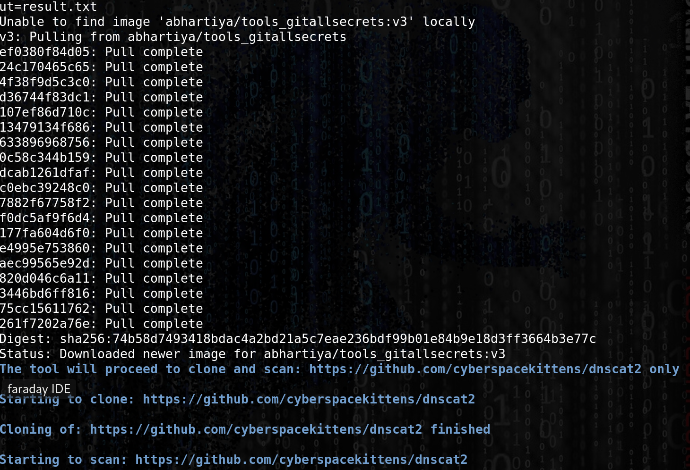

# git-all-secrets

## git-all-secrets 

### usage

* Launch the container and the scan 

```csharp
docker run -it abhartiya/tools_gitallsecrets:v3 -repoURL=https://github.com/cyberspacekittens/dnscat2 -token=GITtokenValue -output=result.txt
```



* List the Docker 

`root@thp3:/opt/git-all-secrets#` 

```csharp
docker ps -a
```

```text
CONTAINER ID        IMAGE                              COMMAND                  CREATED             STATUS                      PORTS               NAMES
a36330844ad5        abhartiya/tools_gitallsecrets:v3   "./gitallsecrets -re…"   8 minutes ago       Exited (0) 28 seconds ago                       romantic_tereshkova
```

* Get the result file on our machine :

```text
docker cp a36330844ad5:/data/result.txt .
```

### Resource



