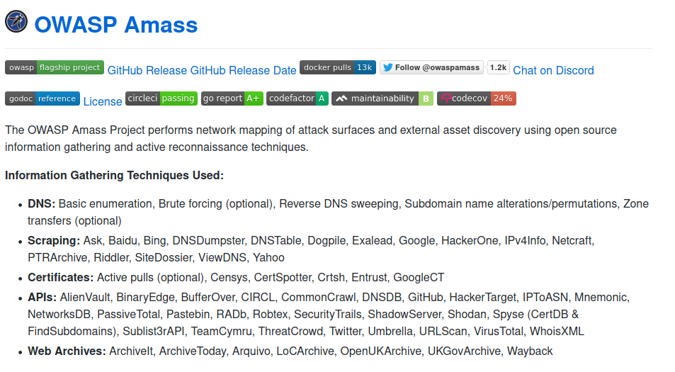
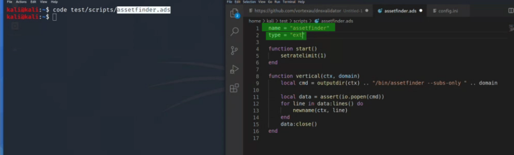

# Amass webscanner

## Amass <a id="amass"></a>



* config files

`/usr/share/amass/examples` `$HOME/.config/amass`

### Subcommands

* enum : enumeration and network mapping.
* intel : provide what you already know to expend the scope.
* track : diffence between different scans on the same target
* db : take control of collected data

### Useful commands

#### Enumeration

`amass enum -src -ip -d owasp.org`

* include and exclude \(using passive \):

`amass enum -src -passive -include crtsh,radb -d target.site`

#### bruteforcing \(using default wordlist and config\)

note: need to modify config.ini.

`amass enum -src -ip -brute target.site`

default config = brute.target.site Recursive 1 = **brute**.www.target.site Recursice 0 = bruteforce eevrything

#### bruteforce and domain name list

`amass enum -src -ip -brute -df domains.txt`

#### DNS resolver

Default DNS resolver = 8

#### DNS validator \(faster results\)

**vortexau github dnsvalidator**



-&gt; create a list

sort -R resolvers.txt \| tail -n 25 &gt; 25\_resolvers.txt

`amass -rf file -max0dns-queries 20000`

### Advanced usage

#### Scripts :

* File must be named whatever.**ads**
* name and type \("ext" must be set\)

```bash
mkdir test/{scripts,bin}
vim test/scripts/assetfiinder.ads
cp go/bin/assetfinder /test/bin
```



* API key must be integrated into `config.ini`

`amass enum -dir test -src -passive -include assetfinder -d target.site`

#### Query the results from the DB

`amass db -summary -d target.site`

#### Visualization

`amass viz -d3 -d target.site`

-&gt; create a file into .config/amass `amass_d3.html`

### `Resources`




