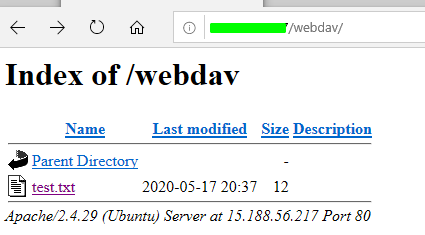
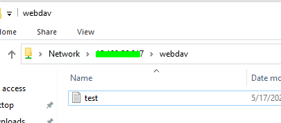

# Webdav & Mod\_Rewrite Rules

## Webdav & Mod\_Rewrite Rules

### About

The goal is to configure Apache and add it Webdav support.

The mod rewrite rules can also be added to allow only specific client. This can help to hide our file against curl request and so on.

### Webdav installation

* Install apache2
* Enable Apache webdav functions

```text
a2enmod dav
a2enmod dav_fs
```

* Create a folder on the web server and set permissions to www-data account

```text
/var/www# mkdir webdav
/var/www# chown -R www-data.www-data webdav/
```

* configure apache2

`cat 000-default.conf`

```text
<VirtualHost *:80>
       ServerAdmin webmaster@localhost
       DocumentRoot /var/www/html
       ErrorLog ${APACHE_LOG_DIR}/error.log
       CustomLog ${APACHE_LOG_DIR}/access.log combined

 Alias /webdav /var/www/webdav
 <Location /webdav>
   Options Indexes
   DAV On
   <LimitExcept GET HEAD OPTIONS PROPFIND>
     Deny from all
   </LimitExcept>
   Satisfy all
 </Location>
</VirtualHost>
```

* Test the connection



* Network access on windows

`\\IP\folder`



* Basic obfuscation using specific agent

### Mod\_Rewrite Rules <a id="mod_rewrite-rules"></a>

* Edit Apache2 config wit the following line \(allow only microsoft-webdav-mini-redir to access to our webdav share\)

```text
SetEnvIfNoCase User-Agent "^(?!Microsoft-WebDAV-MiniRedir).*" goaway
<Location "/webdav/">
    <RequireAll>
            Require all granted
            Require not env goaway
    </RequireAll>
</Location>
```

### Final Apache2 configuration

```text
<VirtualHost *:443>

        ServerAdmin webmaster@localhost
        ServerName YOUR_DOMAIN_HERE
        DocumentRoot /var/www/html/
        ErrorLog ${APACHE_LOG_DIR}/error.log
        CustomLog ${APACHE_LOG_DIR}/access.log combined
        Alias /parts /var/www/parts
        SetEnvIfNoCase User-Agent "^(?!Microsoft-WebDAV-MiniRedir).*" goaway
        <Location /parts>
                Options Indexes
                DAV On
                <RequireAll>
                Require all granted
                Require not env goaway
                </RequireAll>
        <LimitExcept GET HEAD OPTIONS PROPFIND>
                Deny from all
        </LimitExcept>
        Satisfy all
        </Location>

        SSLCertificateFile /etc/letsencrypt/live/your_domain.com/fullchain.pem
        SSLCertificateKeyFile /etc/letsencrypt/live/your_domain.com/privkey.pem
        Include /etc/letsencrypt/options-ssl-apache.conf
</VirtualHost>
```

```text
<VirtualHost *:443>

        ServerAdmin webmaster@localhost
        ServerName YOUR_DOMAIN_HERE
        DocumentRoot /var/www/html/
        ErrorLog ${APACHE_LOG_DIR}/error.log
        CustomLog ${APACHE_LOG_DIR}/access.log combined
        Alias /parts /var/www/parts
        SetEnvIfNoCase User-Agent "^(?!Microsoft-WebDAV-MiniRedir).*" goaway
        <Location /parts>
                Options Indexes
                DAV On
                <RequireAll>
                Require all granted
                Require not env goaway
                </RequireAll>
        <LimitExcept GET HEAD OPTIONS PROPFIND>
                Deny from all
        </LimitExcept>
        Satisfy all
        </Location>

        SSLCertificateFile /etc/letsencrypt/live/site/fullchain.pem
        SSLCertificateKeyFile /etc/letsencrypt/live/site/privkey.pem
        Include /etc/letsencrypt/options-ssl-apache.conf
</VirtualHost>
```

