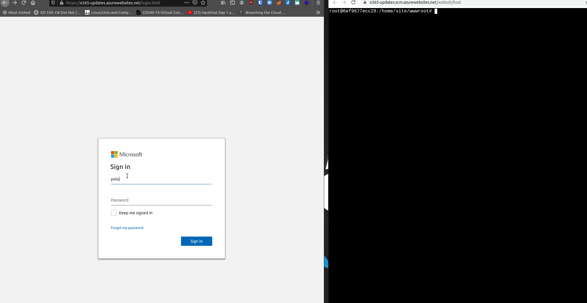

# Zphisher on Azure

## Zphisher on Azure

Install a phishing framework using an Azure Web application with a azurewebsites.net domain to harvest credentials.

### Web App configuration

* Add a "App Service" in Azure Portal 


* Create a Web App


* Set up a free instance container, then use create button 


### Configure the endpoint

* Connect to the resource 


* On the Azure Portal resource, active SSH 


### Install Zphisher

* Install git

```csharp
apt install git vim
```

* Clone Zphisher repo

```csharp
git clone https://github.com/htr-tech/zphisher
```

* Copy chosen files into site folder


```csharp
root@6ef9677ecc28:/home# pwd
/home
root@6ef9677ecc28:/home# ls
ASP.NET  LogFiles  site
root@6ef9677ecc28:/home# cp /opt/zphisher/websites/microsoft/* site/wwwroot/
root@6ef9677ecc28:/home# cd site/wwwroot/
root@6ef9677ecc28:/home/site/wwwroot# rm -rf hostingstart.html
```

* Modify `login.php` to get the redirection you want 


* Send the malicious link to a victim and steal the creds 



### Resource



