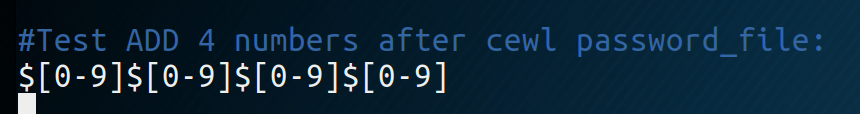

# john the ripper

## john the ripper usage

### Kerberoast

`sudo /opt/JohnTheRipper/run/./john has.txt --wordlist=10_million_password_list_top_1000000.txtjohn --format=krb5tgs has.txt --wordlist=/usr/share/wordlists/10k-worst-passwords.txt`

### NetNTLMv2

`sudo ./john --format=netntlmv2 /home/nyws/test/2 --wordlist=/home/nyws/test/rockyou.txt`

### Zip files

`/opt/JohnTheRipper/run/zip2john Data.zip > testdata.txt`  
 `/opt/JohnTheRipper/run/john testdata.txt`

### Shadow File

`unshadow passwd shadow > password.txt`

`john --wordlist=rockyou.txt password`

\`\`

## Tricks 

* **Modify John configuration to add number to a given password file:**

`vi /etc/john/john.conf`

/home/nyws/.config/joplin-desktop/resources/4acef73ba2e7425abfbfbfc21cc5328b.png

* **Generate a new list :**

`john --wordlist=pass.txt --rules --stdout > number.txt`

