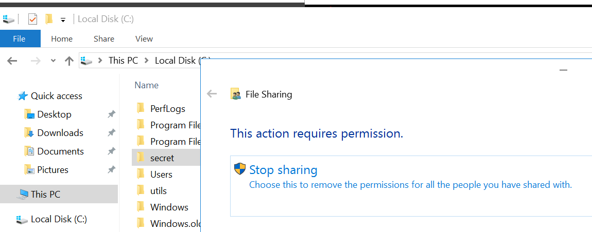
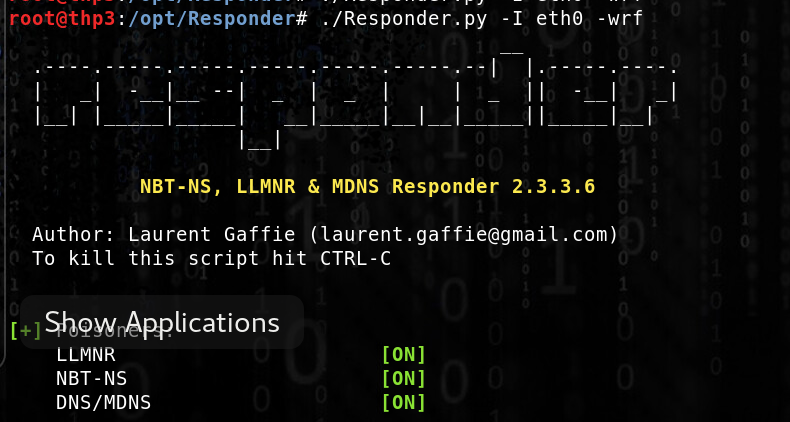
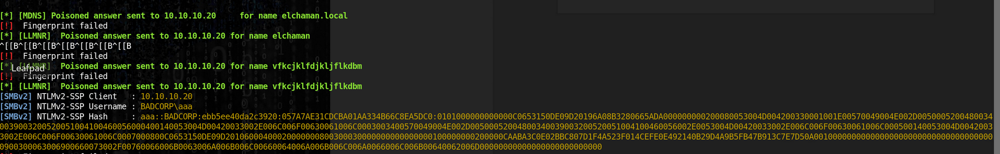

# NTLMv2 challenge/response

## NTLMv2 challenge/response

**Must be cracked offline using hashcat or john.**

* Create a share on the dc
* mount the share on a domain computer
* remove the share in the DC

Set up Responder on the attacking machine \(same subnet\) :

Type a bad share name in the victim host and get an answer :

