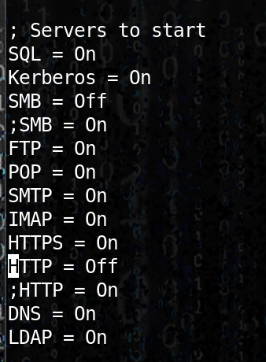
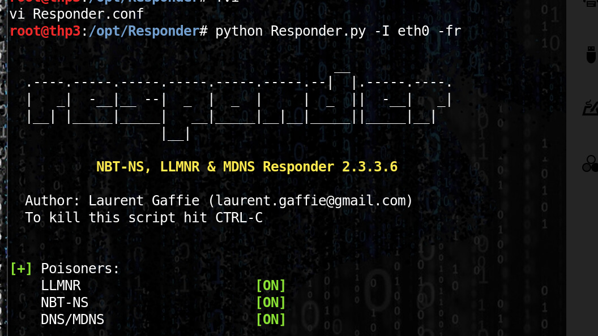
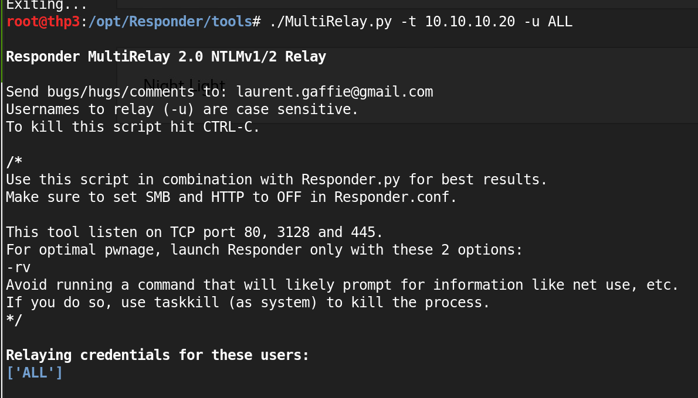
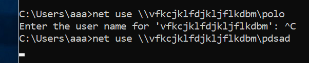
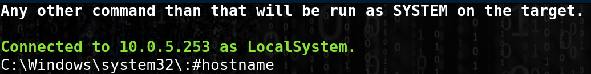

# Responder and Multirelay

## Responder and Multirelay

This attack must be focused on Administrator users ...

Attack can be avoided using SMB signing

```text
Turn off SMB and HTTP in responder.conf (/etc/ or other)
```

### Launch responder and multirelay

* Turn off SMB and HTTP in responder.conf \(/etc/ or other\)







### On the victim 



### **Pwn the box**



