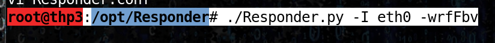
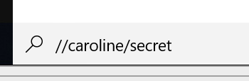
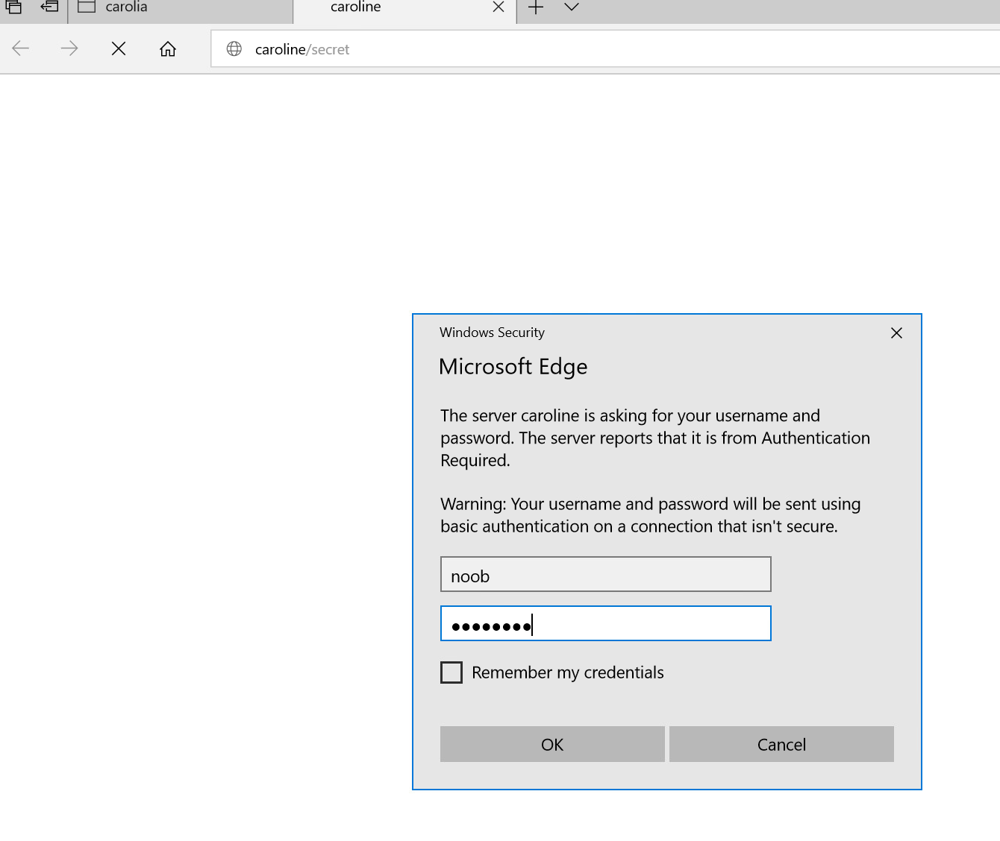

# Fake login screen

## Fake login screen

### Launch responder

### On the victim

* The client try to connect on the share using internet explorer :

* Get the account/password in clear text :\).

