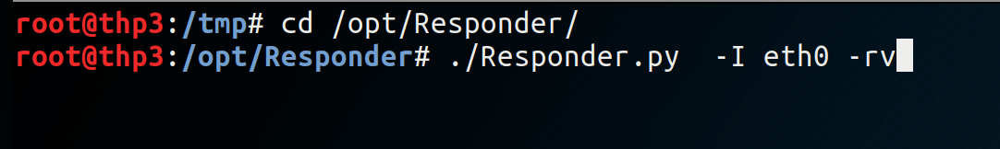
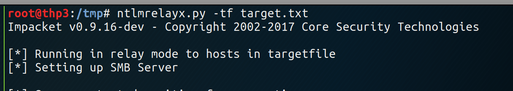
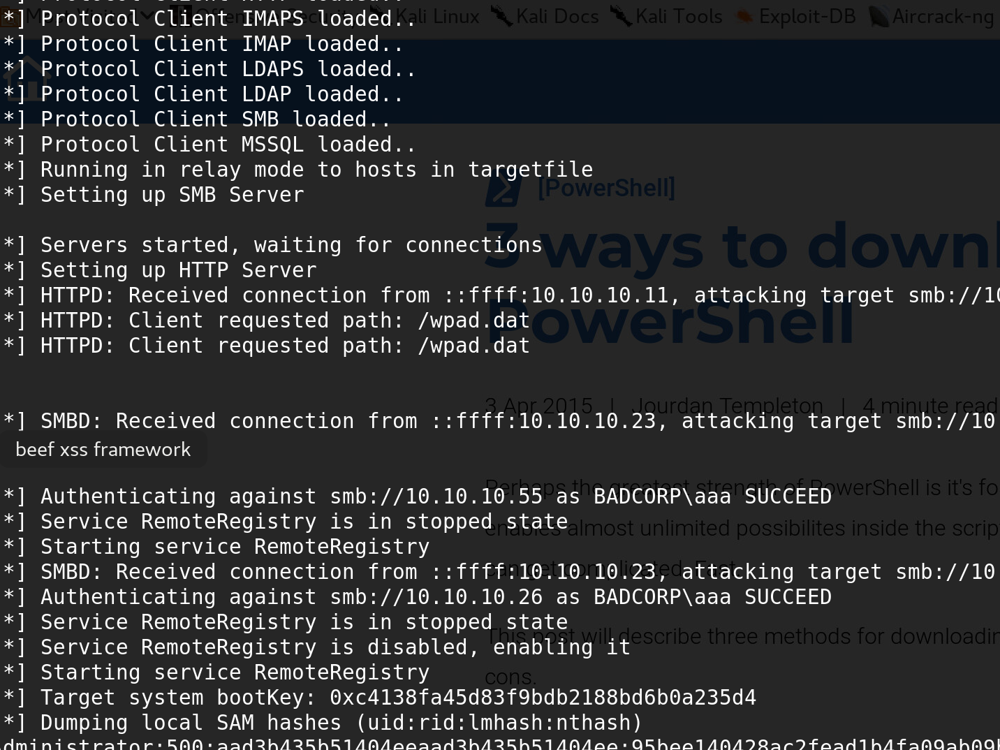

# responder-ntlmrelay

## responder-ntlmrelay

### **Create a target list**

 `root@thp3:/tmp# cat target.txt`  
 10.4.4.4  
 10.4.4.19  
 10.4.4.29  
 10.4.4.37  
 10.4.4.40  
 10.4.4.68  
 10.4.4.94  
 10.4.4.96  
 10.4.4.121  
 10.4.5.62  
 10.4.5.93  
 10.4.5.135  
 10.4.5.175  
 10.4.5.178  
 10.4.5.214  
 10.4.5.230

### Use Responder to poison the LAN using LLMNR

### Use ntlmrelay with the target list

\*\*\*\*

