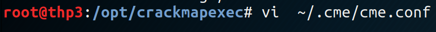
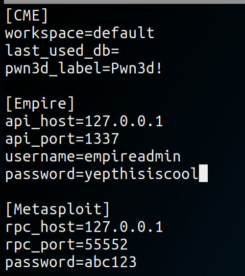
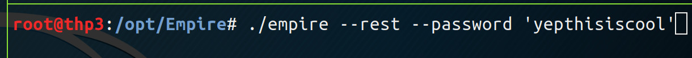
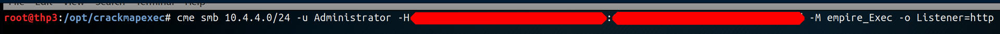
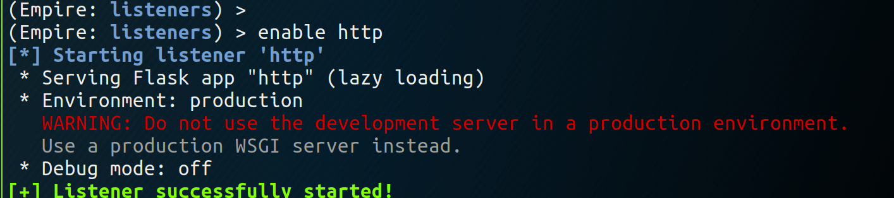
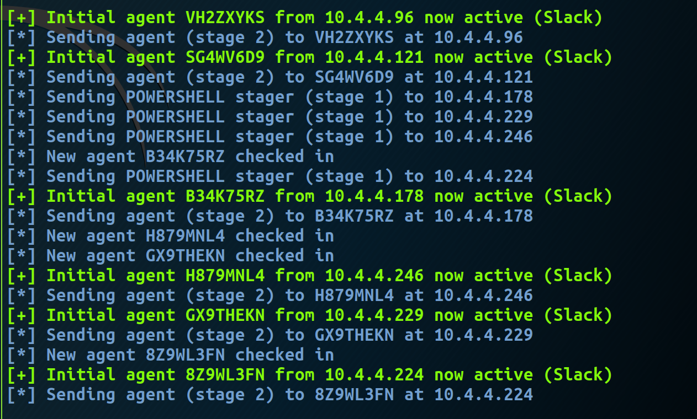

# Crackmapexec and Empire

## Crackmapexec and Empire

Using creds retrieved from Responder \(or hashes\) :

### **1\) Configure Empire and crackmapexec \(cmd\) passwords :**

* **Crackmap** :

* **Empire** :

### **2\) Start the attack :**

### **3\) Set up the listener in Empire :**

### **4\) and get session**

## Resources





